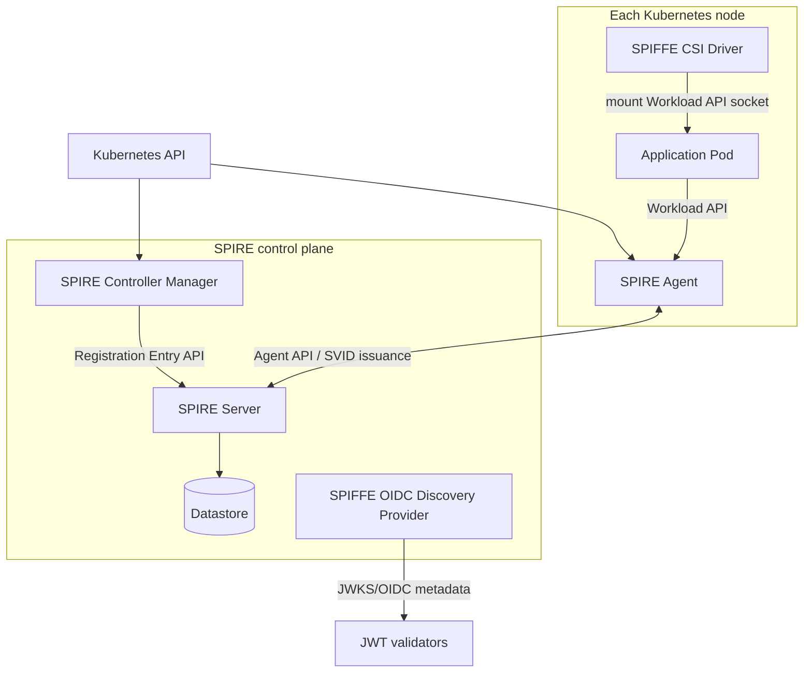
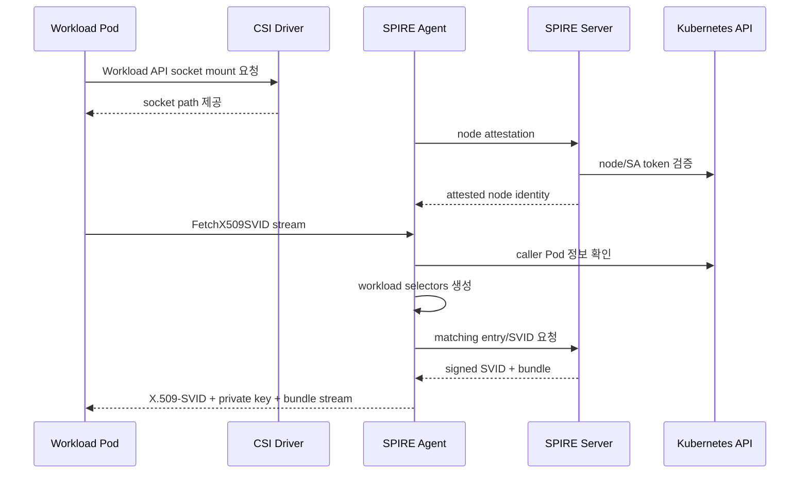
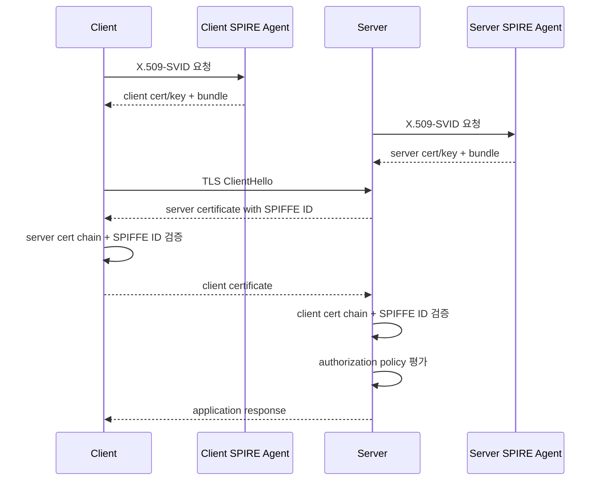

# SPIFFE/SPIRE 기초: workload identity를 신뢰 가능한 운영 단위로 만들기

이 문서는 Kubernetes와 분산 시스템에서 **서비스가 누구인지**를 안전하게 증명하기 위한 SPIFFE/SPIRE 학습 자료다. 목적은 용어 암기가 아니라, 장애와 침해 상황에서 다음 질문에 답할 수 있게 만드는 것이다.

- 이 요청을 보낸 workload가 정말 우리가 기대한 workload인가?
- 어떤 기준으로 그 workload에게 identity를 발급했는가?
- 인증서나 JWT가 탈취되었을 때 피해 범위와 유효 시간은 어디까지인가?
- SPIRE Server, Agent, Controller Manager, CSI driver 중 어디에서 문제가 났는가?
- 인증(authentication)과 인가(authorization)를 어디서 분리해야 하는가?

조사 기준 시점은 **2026-08-17**이다. SPIRE 최신 문서와 release 기준은 **v1.15.2, 2026-07-09 공개**다. 설치 전에는 항상 공식 release와 chart version을 다시 확인한다.

## 먼저 결론

SPIFFE는 workload identity를 표현하고 검증하는 **표준**이다. SPIRE는 그 표준을 실제 인프라에서 발급·회전·검증 가능하게 만드는 **구현체**다.

| 질문 | SPIFFE가 답하는 것 | SPIRE가 답하는 것 |
| --- | --- | --- |
| identity 이름은 어떤 형식인가? | `spiffe://<trust-domain>/<path>` | registration entry와 selector로 어떤 workload에 어떤 ID를 줄지 결정 |
| identity 증명 문서는 무엇인가? | X.509-SVID, JWT-SVID, WIT-SVID 규격 | SVID 발급, 갱신, bundle 제공 |
| workload는 어디서 identity를 받는가? | SPIFFE Workload API 규격 | SPIRE Agent가 로컬 Workload Endpoint 제공 |
| 어떤 root를 신뢰하는가? | trust domain과 bundle 규격 | Server가 bundle 관리, Agent가 workload에 전달 |
| Kubernetes에서 어떻게 배포하는가? | 표준 범위 밖 | Helm chart, Controller Manager, CSI driver, node/workload attestor |

핵심은 “비밀을 배포하지 않고도 workload가 자신의 identity를 얻는다”는 점이다. 애플리케이션 이미지 안에 client certificate, private key, API token을 넣지 않는다. workload는 로컬 Workload API에 연결하고, SPIRE Agent는 그 호출자가 어떤 프로세스/Pod인지 attest한 뒤 해당 workload에 허용된 짧은 수명 SVID를 돌려준다.

## 왜 필요한가

### IP와 DNS 이름은 identity가 아니다

전통적인 내부망 설계에서는 서비스 identity를 IP, DNS, namespace, service name, static API key로 대충 대신하는 경우가 많다.

| 방식 | 왜 부족한가 |
| --- | --- |
| Pod IP | 재시작·스케일링 때 바뀐다. 같은 IP가 나중에 다른 Pod에 재사용될 수 있다. |
| Kubernetes Service DNS | load balancing 이름일 뿐, 개별 workload 인스턴스의 신원을 증명하지 않는다. |
| Namespace 이름 | 배치 위치다. 요청을 보낸 실제 프로세스를 증명하지 않는다. |
| Static API key | 복사·재사용·유출 탐지가 어렵고, 회전이 애플리케이션 배포와 묶인다. |
| Long-lived client cert | 처음에는 안전해 보이지만 private key 배포·보관·회전 문제가 남는다. |

SPIFFE/SPIRE는 “어디에서 왔는가”보다 “어떤 검증 과정을 통과해 어떤 trust domain의 어떤 identity를 받았는가”를 중심에 둔다.

### zero trust에서 필요한 최소 단위

zero trust를 실제로 하려면 네트워크 내부라는 이유만으로 신뢰하지 않아야 한다. 그렇다고 모든 서비스에 사람이 발급한 계정과 비밀번호를 넣으면 운영이 깨진다. 필요한 것은 다음 성질을 가진 workload identity다.

- 자동 발급: 새 Pod나 VM이 생길 때 사람이 인증서를 만들지 않는다.
- 짧은 수명: 탈취되어도 오래 쓸 수 없다.
- 자동 회전: workload 재배포 없이 갱신된다.
- 검증 가능한 발급 근거: 어떤 node와 workload 속성을 보고 발급했는지 추적할 수 있다.
- 플랫폼 중립: Kubernetes, VM, bare metal, cloud provider를 같은 identity model로 묶을 수 있다.
- 상호 인증: client와 server가 서로의 identity를 검증할 수 있다.

## 위협 모델

SPIFFE/SPIRE는 모든 보안 문제를 해결하지 않는다. 어떤 위협을 줄이는지와 줄이지 못하는지를 분리해야 한다.

### 줄이는 위협

| 위협 | SPIFFE/SPIRE가 줄이는 방식 |
| --- | --- |
| static credential 유출 | 장기 secret 대신 짧은 수명 SVID를 Workload API로 발급한다. |
| 내부망 위조 요청 | mTLS에서 peer certificate의 SPIFFE ID와 trust bundle을 검증한다. |
| 잘못된 서비스로 라우팅 | 서버 identity를 검증하므로 DNS/IP만 믿지 않는다. |
| 같은 namespace의 다른 Pod가 key 재사용 | private key는 Workload API 응답으로 해당 workload에만 전달되고 짧게 유지된다. |
| node 위장 | node attestation으로 Agent가 어떤 node에서 실행되는지 검증한다. |
| workload 위장 | workload attestation selector로 Pod namespace, service account, UID 등을 확인한다. |
| CA bundle drift | Workload API stream으로 bundle 갱신을 전달한다. |

### 줄이지 못하는 위협

| 위협 | 남는 이유와 대응 |
| --- | --- |
| 이미 침해된 workload 프로세스 | 프로세스가 SVID를 사용할 권한이 있으면 공격자도 그 권한을 사용할 수 있다. 런타임 방어, egress policy, least privilege가 필요하다. |
| 잘못 작성된 authorization policy | SPIFFE ID는 인증 결과다. “무엇을 허용할지”는 별도 정책으로 제한해야 한다. |
| 지나치게 넓은 selector | `namespace=prod`만으로 모든 prod Pod에 같은 ID를 주면 privilege escalation이 된다. selector 설계가 핵심이다. |
| SPIRE Server signing key 유출 | trust domain 자체가 위험해진다. HSM/KMS, backup, rotation, audit가 필요하다. |
| Agent socket 과다 노출 | Pod가 Workload API socket을 마운트할 수 있으면 SVID 요청 경로가 열린다. CSI mount와 RBAC를 제한한다. |
| JWT replay | JWT-SVID는 bearer token 성격이라 탈취 시 만료 전 재사용 가능하다. 가능한 경우 X.509-SVID와 mTLS를 우선한다. |
| 애플리케이션 취약점 | identity는 요청 주체를 알려줄 뿐 SQL injection, SSRF, business logic bug를 막지 않는다. |

## SPIFFE와 SPIRE

### SPIFFE

SPIFFE는 Secure Production Identity Framework for Everyone의 약자다. 프로젝트 이름이기도 하지만, 실무에서는 보통 다음 표준 묶음을 의미한다.

- SPIFFE ID 형식
- SVID라는 검증 가능한 identity document
- trust domain과 trust bundle
- X.509-SVID
- JWT-SVID
- WIT-SVID
- Workload API와 Workload Endpoint
- Federation

SPIFFE 표준의 핵심은 interoperability다. 즉, 한 구현체가 발급한 SPIFFE-conformant SVID를 다른 구현체나 library가 같은 규칙으로 검증할 수 있어야 한다.

### SPIRE

SPIRE는 SPIFFE Runtime Environment다. SPIFFE 표준을 실제 환경에 구현한다.

SPIRE가 제공하는 주요 기능:

- SPIRE Server: trust domain의 CA/issuer, registration entry 저장, Agent attestation, SVID signing
- SPIRE Agent: 각 node에서 workload attestation 수행, Workload API 제공, Server와 통신
- Node attestor plugin: Agent가 실행되는 node를 검증
- Workload attestor plugin: Workload API 호출자가 어떤 workload인지 검증
- Datastore/plugin: registration entry, bundle, attested node 상태 저장
- Controller Manager: Kubernetes CRD를 SPIRE registration entry로 reconcile
- CSI driver: Pod에 Workload API socket을 안전하게 mount
- OIDC Discovery Provider: JWT-SVID 검증에 필요한 JWKS/OIDC metadata 제공

## SPIFFE ID

SPIFFE ID는 URI다.

```text
spiffe://<trust-domain>/<path>
```

예:

```text
spiffe://lab.example.org/ns/payments/sa/api
spiffe://lab.example.org/ns/checkout/sa/frontend
spiffe://prod.example.org/spire/agent/k8s_psat/prod-cluster/<node-uid>
```

### 구성 요소

| 부분 | 의미 |
| --- | --- |
| `spiffe` scheme | 이 URI가 SPIFFE ID임을 나타낸다. |
| trust domain | identity를 발급하고 검증하는 신뢰 경계다. |
| path | trust domain 안에서 workload를 구분하는 운영자 정의 경로다. |

### 설계 원칙

좋은 SPIFFE ID는 다음 성질을 가진다.

- 안정적이다: Pod UID처럼 너무 자주 바뀌는 값만으로 app identity를 만들지 않는다.
- 구체적이다: `spiffe://example.org/app`처럼 너무 넓게 만들지 않는다.
- 권한 경계와 맞다: authorization policy에서 사용할 수 있을 만큼 의미가 있다.
- 소유자가 분명하다: 어떤 팀/서비스가 이 ID를 사용하는지 추적 가능하다.
- 환경 경계를 포함한다: dev/prod가 같은 trust domain과 path를 공유하지 않도록 설계한다.

나쁜 예:

```text
# 너무 넓다. prod namespace 모든 workload가 같은 ID를 받을 위험이 있다.
spiffe://example.org/prod

# DNS domain을 기계적으로 복사했지만 service account나 workload 경계가 없다.
spiffe://example.org/service
```

더 나은 예:

```text
spiffe://prod.example.org/ns/payments/sa/payment-api
spiffe://prod.example.org/ns/payments/sa/payment-worker
spiffe://stage.example.org/ns/payments/sa/payment-api
```

## Trust domain

trust domain은 SPIFFE identity의 관리 경계다. DNS domain과 비슷하게 보이지만 같은 개념은 아니다.

```text
spiffe://prod.example.org/ns/payments/sa/api
          └──────────────┘
             trust domain
```

trust domain이 의미하는 것:

- 어떤 signing authority가 이 identity를 발급하는가
- 어떤 trust bundle로 이 SVID를 검증하는가
- federation 시 어떤 외부 trust domain을 신뢰할 것인가
- 장애나 침해 시 어느 범위까지 영향이 전파되는가

### trust domain 설계 선택지

| 설계 | 장점 | 위험 |
| --- | --- | --- |
| 환경별 분리: `dev.example.org`, `prod.example.org` | dev 침해가 prod trust로 직접 이어지지 않는다. | federation과 policy가 더 필요하다. |
| 클러스터별 분리 | blast radius가 작다. | multi-cluster 서비스 간 통신 설정이 복잡하다. |
| 조직 전체 단일 domain | 운영이 단순하다. | 하나의 trust root 문제가 전체로 퍼질 수 있다. |

운영에서는 “간단해서 단일 trust domain”보다 “침해와 실수의 blast radius”를 먼저 본다.

## Trust bundle

trust bundle은 특정 trust domain에서 발급한 SVID를 검증하기 위한 public trust material이다. X.509-SVID에서는 CA certificate가, JWT-SVID에서는 JWT signing public key가 들어간다. SPIFFE bundle은 JWK Set 형식을 사용한다.

중요한 점:

- bundle은 비밀값이 아니다. 하지만 무결성이 중요하다.
- bundle이 바뀌면 peer 검증 결과가 바뀐다.
- 빈 bundle이나 usable key가 없는 bundle은 해당 trust domain의 SVID를 신뢰하지 말라는 뜻으로 취급해야 한다.
- federation에서는 외부 trust domain bundle도 함께 전달될 수 있다.

## SVID

SVID는 SPIFFE Verifiable Identity Document다. workload가 “내 SPIFFE ID는 이것이다”라고 증명할 때 사용하는 문서다.

SVID에는 기본적으로 다음이 포함된다.

- SPIFFE ID
- issuer/signature
- 만료 시간
- 형식에 따라 public key 또는 token claims

SVID는 영구 자격 증명이 아니다. 짧은 수명과 자동 회전을 전제로 한다.

## X.509-SVID와 JWT-SVID 비교

| 항목 | X.509-SVID | JWT-SVID |
| --- | --- | --- |
| 형식 | X.509 certificate | JWT |
| 주 사용처 | mTLS, TLS client/server auth | HTTP bearer token, OIDC/JWKS 기반 검증 |
| private key | workload가 certificate의 private key로 소유 증명 | JWT 자체가 bearer token이다. 별도 proof-of-possession이 약하다. |
| replay 위험 | TLS handshake와 private key 소유가 필요해 상대적으로 낮다. | 탈취된 token은 만료 전 재사용될 수 있다. |
| audience | TLS peer 검증과 authorization policy에서 처리 | Workload API 요청 시 audience가 필수 |
| 회전 | certificate/key pair를 stream으로 갱신 | token 만료 전에 새 token을 요청 |
| bundle | X.509 CA bundle | JWT signing key bundle/JWKS |
| 적합한 경우 | 서비스 간 직접 연결, service mesh, gRPC/HTTP mTLS | 외부 서비스가 JWT만 받는 경우, L7 proxy 뒤 검증, federation-to-OIDC |
| 주의점 | 애플리케이션이 certificate reload를 지원해야 한다. | audience, issuer, expiry 검증을 빼면 bearer token 사고가 된다. |

가능하면 workload 간 직접 통신에는 X.509-SVID 기반 mTLS를 우선한다. JWT-SVID는 “상대 시스템이 JWT 검증 모델만 지원한다”거나 “L7 gateway에서 token을 검증해야 한다”처럼 이유가 있을 때 사용한다.

## WIT-SVID 주의

2026-08-17 기준 Workload API 문서에는 WIT-SVID profile이 포함되어 있지만, 해당 section은 **Incubating**으로 표시되어 있다. X.509-SVID와 JWT-SVID는 mandatory profile이지만, WIT-SVID는 optional profile이다.

운영 판단:

- WIT-SVID를 일반 가용 기능처럼 전제하지 않는다.
- SPIRE 배포에서 지원 여부를 별도로 확인한다.
- library와 proxy 지원 현황을 검증한다.
- production policy는 X.509-SVID/JWT-SVID 중심으로 설계하고, WIT-SVID는 별도 실험 트랙으로 둔다.

## Workload API와 Workload Endpoint

Workload API는 workload가 SVID와 bundle을 가져오는 표준 gRPC API다. Workload Endpoint는 이 API를 제공하는 로컬 endpoint다.

SPIRE Kubernetes 배포에서는 일반적으로 SPIRE Agent가 Unix domain socket을 제공하고, CSI driver가 Pod에 socket을 mount한다.

예상 socket path는 배포 방식에 따라 다르다. 문서나 chart values에서 확인한다.

```bash
# 예: Pod 안에서 socket mount 여부 확인
kubectl -n <APP_NAMESPACE> exec deploy/<DEPLOYMENT_NAME> -- \
  sh -c 'ls -l /spiffe-workload-api || true; find / -name "*api.sock" 2>/dev/null | head'
```

Workload API의 중요한 동작:

- 호출 workload는 별도 bootstrap token 없이 로컬 endpoint에 연결한다.
- endpoint 구현체가 OS/Kubernetes 정보를 보고 호출자를 식별한다.
- X.509-SVID와 bundle은 stream으로 전달되며 변경 시 새 response가 온다.
- workload가 더 이상 권한이 없으면 SVID를 사용 중지해야 한다.
- foreign trust domain bundle이 포함될 수 있다.

## Attestation

attestation은 “이 node/workload가 주장하는 속성이 맞는지 검증하는 과정”이다. SPIRE는 크게 node attestation과 workload attestation을 나눈다.

### Node attestation

Node attestation은 SPIRE Agent가 어떤 node에서 실행 중인지 Server가 검증하는 과정이다.

Kubernetes에서는 흔히 `k8s_psat` 계열 attestor를 사용한다. projected ServiceAccount token을 통해 Agent가 Kubernetes API와 연결된 실제 node/pod라는 사실을 검증한다.

개념 흐름:

1. SPIRE Agent가 시작한다.
2. Agent가 node attestation material을 Server에 제출한다.
3. Server node attestor plugin이 Kubernetes API 또는 cloud metadata 등 외부 근거를 검증한다.
4. 검증에 성공하면 Agent에게 node identity가 부여된다.
5. Server는 이 Agent가 어떤 workload identity를 발급받아 전달할 수 있는지 registration entry의 `parentID`로 제한한다.

### Workload attestation

Workload attestation은 Workload API 호출자가 어떤 workload인지 Agent가 식별하는 과정이다.

Kubernetes에서 흔한 selector:

```text
k8s:ns:payments
k8s:sa:payment-api
k8s:pod-label:app:payment-api
k8s:container-name:app
```

정확한 selector 이름과 형태는 SPIRE workload attestor plugin과 버전에 따라 확인해야 한다. 운영 문서에는 “어떤 selector를 신뢰 근거로 삼는지”를 반드시 남긴다.

### selector 설계 원칙

selector는 identity 발급 조건이다. 넓게 잡으면 아무 Pod나 강한 identity를 받을 수 있다.

| selector 수준 | 예 | 평가 |
| --- | --- | --- |
| namespace만 | `k8s:ns:prod` | 너무 넓다. 같은 namespace의 다른 workload도 매칭된다. |
| namespace + service account | `k8s:ns:payments`, `k8s:sa:payment-api` | Kubernetes에서 일반적인 최소 기준이다. |
| namespace + service account + label | 위 조건 + `app=payment-api` | label spoofing 가능성을 RBAC/admission으로 통제해야 한다. |
| container/process 속성 추가 | Kubernetes selector + unix selector | 더 강하지만 운영 복잡도가 올라간다. |

## SPIRE 아키텍처

### 전체 구성



### SPIRE Server

Server의 책임:

- trust domain signing authority 역할
- Agent node attestation 검증
- registration entry 저장과 조회
- SVID 발급
- trust bundle 관리
- federation bundle endpoint 제공
- Admin API/Registration API 제공

Server 장애 영향:

- 이미 발급된 SVID는 만료 전까지 사용 가능할 수 있다.
- 새 SVID 발급과 rotation이 막힌다.
- Agent가 Server와 재연결하지 못하면 시간이 지나 인증 실패가 발생한다.

### SPIRE Agent

Agent의 책임:

- node마다 실행
- Server에 node attestation 수행
- Workload API endpoint 제공
- workload attestation 수행
- workload에 허용된 SVID와 bundle 전달
- SVID cache와 rotation stream 관리

Agent 장애 영향:

- 해당 node의 workload가 새 SVID를 받지 못한다.
- socket 연결이 실패한다.
- 기존 연결과 cache 상태에 따라 장애가 지연되어 나타날 수 있다.

### SPIRE Controller Manager

Kubernetes에서 registration entry를 수동 CLI로 관리하면 drift가 생긴다. Controller Manager는 Kubernetes CRD를 보고 SPIRE Server entry를 reconcile한다.

대표 CRD:

- `ClusterSPIFFEID`: Pod/namespace selector에 맞는 workload identity 선언
- `ClusterStaticEntry`: Kubernetes 밖 workload 또는 특수 entry 선언
- `ClusterFederatedTrustDomain`: federation 관계 선언

운영 원칙:

- GitOps 환경에서는 CRD/values로 선언하고 Controller Manager가 Server entry를 맞추게 한다.
- Controller Manager를 쓰는 경우, 같은 entry를 수동으로 만들고 수정하지 않는다.
- 상태 필드와 controller log를 장애 분석의 첫 단서로 본다.

### SPIFFE CSI Driver

CSI driver는 Workload API socket을 Pod에 mount하는 역할을 한다. application Pod가 Agent socket에 접근하려면 안전한 전달 경로가 필요하다.

위험:

- socket이 너무 많은 Pod에 mount되면 identity 발급 표면이 넓어진다.
- hostPath로 Agent socket을 직접 공유하면 정책과 추적이 어려워질 수 있다.

운영 원칙:

- 공식 chart와 CSI driver 패턴을 사용한다.
- mount path를 표준화한다.
- socket을 사용하는 namespace와 service account를 제한한다.

## Registration entry

registration entry는 “어떤 parent 아래에서 어떤 selector를 만족하는 workload에게 어떤 SPIFFE ID를 줄 것인가”를 나타낸다.

핵심 필드:

| 필드 | 의미 |
| --- | --- |
| SPIFFE ID | workload에 발급할 identity |
| Parent ID | 이 entry를 만족하는 workload를 attest할 수 있는 Agent/node identity |
| Selectors | workload가 만족해야 하는 조건 |
| TTL | SVID 수명 |
| DNS names | X.509-SVID SAN에 포함할 DNS 이름 |
| Federates with | 이 workload가 받을 foreign bundle |

수동 entry 예시:

```bash
# 학습용 예시다. Controller Manager를 쓰는 운영 환경에서는 CRD/values 기반 선언을 우선한다.
spire-server entry create \
  -spiffeID spiffe://lab.example.org/ns/payments/sa/payment-api \
  -parentID spiffe://lab.example.org/spire/agent/k8s_psat/REPLACE_CLUSTER/REPLACE_NODE_UID \
  -selector k8s:ns:payments \
  -selector k8s:sa:payment-api \
  -ttl 3600
```

주의:

- `parentID`가 실제 Agent identity와 맞지 않으면 workload는 SVID를 받지 못한다.
- selector가 workload attestor가 실제로 생성하는 selector와 맞아야 한다.
- Controller Manager 사용 시 수동 변경은 reconcile로 되돌아갈 수 있다.

## SVID 발급, 회전, 폐기 흐름

### End-to-end issuance



### Rotation

SVID는 짧게 유지하고 만료 전에 교체한다. Workload API stream을 사용하는 library는 새 SVID가 오면 TLS config나 token cache를 갱신해야 한다.

관찰 포인트:

```bash
# Pod 내부에서 SVID 만료 시각 확인. 실제 socket path는 환경에 맞게 바꾼다.
kubectl -n <APP_NAMESPACE> exec deploy/<DEPLOYMENT_NAME> -- \
  sh -c 'spire-agent api fetch x509 -socketPath /spiffe-workload-api/spire-agent.sock -write /tmp/svid >/tmp/fetch.log 2>&1 & sleep 2; openssl x509 -in /tmp/svid/svid.0.pem -noout -subject -issuer -dates'
```

위 명령은 실습용이다. 운영에서는 private key와 SVID를 파일로 오래 남기지 않는다.

### Revocation과 권한 제거

SPIFFE/SPIRE에서 일반적인 폐기 모델은 “짧은 TTL + rotation + entry 제거”다.

권한 제거 시:

1. `ClusterSPIFFEID` 또는 registration entry에서 workload 매칭을 제거한다.
2. Controller Manager가 SPIRE Server entry를 reconcile한다.
3. Agent는 더 이상 해당 workload에 SVID를 제공하지 않는다.
4. 이미 발급된 짧은 수명 SVID는 만료될 때까지 통과할 수 있으므로 TTL을 정책에 맞게 짧게 둔다.
5. 강제 차단이 필요하면 authorization layer에서 해당 SPIFFE ID를 즉시 deny한다.

중요: SVID 만료 전 “이미 발급된 identity의 의미”가 바뀌지 않는다는 점을 고려해야 한다. 역할/권한처럼 자주 바뀌는 정보를 SVID 자체에 과하게 넣으면 폐기 지연 문제가 커진다.

## Federation

Federation은 서로 다른 trust domain이 상대방 bundle을 교환해 SVID를 검증할 수 있게 만드는 기능이다.

예:

- `spiffe://cluster-a.example.org/ns/payments/sa/api`
- `spiffe://cluster-b.example.org/ns/orders/sa/api`

cluster A workload가 cluster B workload와 mTLS를 하려면:

1. A는 B trust domain의 bundle을 알아야 한다.
2. B는 A trust domain의 bundle을 알아야 한다.
3. 각 workload의 authorization policy가 외부 SPIFFE ID를 허용해야 한다.

Federation은 인증 신뢰를 연결할 뿐이다. 자동으로 모든 요청을 허용하지 않는다.

운영 체크:

```bash
# ClusterFederatedTrustDomain 존재 확인
kubectl get clusterfederatedtrustdomains

# SPIRE Server federation endpoint 노출 여부 확인
kubectl get svc,ingress -A | grep -i spire
```

## 인증과 인가를 분리하기

SPIFFE/SPIRE는 주로 authentication system이다. “요청자가 누구인가”를 강하게 증명한다. “그 요청자가 무엇을 할 수 있는가”는 authorization이다.

잘못된 사고:

```text
SPIRE가 인증서를 줬으니 이 서비스는 DB admin 권한을 가져도 된다.
```

올바른 사고:

```text
SPIRE가 spiffe://prod.example.org/ns/payments/sa/payment-api임을 증명했다.
이 ID가 /payments/charge API를 호출할 수 있는지는 별도 정책으로 판단한다.
```

authorization 위치:

- 애플리케이션 코드
- Envoy/Istio/Linkerd 같은 proxy policy
- API gateway
- Open Policy Agent
- OpenBao policy
- database authorization mapping

권장:

- allowlist 기반으로 peer SPIFFE ID를 명시한다.
- wildcard를 줄인다.
- trust domain 전체 허용을 기본값으로 두지 않는다.
- JWT-SVID는 `aud`, `iss`, `sub`, `exp`를 모두 검증한다.

## mTLS 요청 흐름

X.509-SVID 기반 mTLS는 다음처럼 동작한다.



검증해야 하는 것:

- certificate chain이 해당 trust domain bundle로 검증되는가
- leaf certificate가 CA certificate가 아닌가
- URI SAN에 정확히 기대한 SPIFFE ID가 있는가
- SVID가 만료되지 않았는가
- peer SPIFFE ID가 authorization policy에 허용되어 있는가
- federation peer라면 foreign bundle이 신뢰된 경로로 들어왔는가

## 운영자가 자주 오해하는 것

### “SPIFFE ID path는 DNS 이름이어야 한다”

아니다. SPIFFE ID는 URI이고 path는 운영자가 정한다. DNS 이름과 맞출 수는 있지만 필수는 아니다. DNS 이름이 필요한 경우 X.509-SVID의 DNS SAN을 별도로 설정할 수 있다.

### “trust domain은 반드시 회사 DNS domain과 같아야 한다”

아니다. 하지만 외부 노출, OIDC discovery, federation 운영을 고려하면 DNS와 연관된 이름을 쓰는 것이 관리상 편할 수 있다. 중요한 것은 누가 그 trust domain을 관리하고 어떤 bundle을 배포하는지다.

### “SPIRE를 설치하면 authorization도 자동 해결된다”

아니다. SPIRE는 peer identity를 증명한다. 허용/거부 정책은 별도로 작성해야 한다.

### “JWT-SVID는 X.509-SVID보다 단순하니 항상 낫다”

아니다. JWT-SVID는 bearer token이다. 탈취 시 만료 전 replay가 가능하므로 audience와 TTL을 엄격히 관리해야 한다.

### “SVID private key를 Kubernetes Secret으로 저장하면 된다”

대부분 피해야 한다. Workload API와 library가 회전을 따라가게 하는 것이 기본 모델이다. 실습에서 파일로 쓰는 것은 확인 목적이며 오래 남기면 안 된다.

### “registration entry는 한 번 만들면 끝이다”

아니다. Kubernetes workload label, service account, namespace, controller reconcile 상태가 바뀌면 매칭이 깨질 수 있다. GitOps와 status 확인이 필요하다.

## 한계와 설계상 주의

| 한계 | 운영 대응 |
| --- | --- |
| SVID TTL 동안 옛 assertion이 유효하다. | TTL을 짧게 유지하고 즉시 차단은 authorization layer에서 처리한다. |
| workload compromise는 identity compromise다. | 런타임 격리, network policy, egress 제한, least privilege가 필요하다. |
| selector는 Kubernetes RBAC/admission에 의존한다. | service account 생성권한, label 변경권한, namespace 관리권한을 통제한다. |
| Server가 trust root다. | HA, 백업, datastore 보호, signing key 보호, audit를 설계한다. |
| library 통합이 필요하다. | spiffe-helper, sidecar/proxy, language SDK 중 운영 모델에 맞게 고른다. |
| federation은 복잡하다. | trust domain별 소유자, bundle endpoint, ingress, authorization policy를 문서화한다. |

## 장애 분류 기준

SVID를 받지 못할 때는 다음 순서로 본다.

1. 설치 문제: Server/Agent/CSI/Controller Manager Pod가 정상인가?
2. node attestation 문제: Agent가 Server에 attest되었는가?
3. registration 문제: workload에 매칭되는 entry 또는 ClusterSPIFFEID가 있는가?
4. workload attestation 문제: selector가 실제 Pod 속성과 맞는가?
5. delivery 문제: Pod에 Workload API socket이 mount되었는가?
6. client 문제: 애플리케이션이 올바른 socket path와 Workload API를 사용하는가?
7. authorization 문제: SVID는 받았지만 peer가 거부하는가?

기본 확인 명령:

```bash
kubectl get pods -A | grep -Ei 'spire|spiffe'
kubectl get clusterspiffeids,clusterstaticentries,clusterfederatedtrustdomains 2>/dev/null || true
kubectl -n <SPIRE_SERVER_NAMESPACE> logs statefulset/spire-server -c spire-server --tail=200
kubectl -n <SPIRE_SYSTEM_NAMESPACE> logs daemonset/spire-agent -c spire-agent --tail=200
kubectl -n <APP_NAMESPACE> describe pod <POD_NAME>
```

## 용어 사전

| 용어 | 의미 |
| --- | --- |
| Workload | identity가 필요한 실행 단위. Pod, process, service instance 등이 될 수 있다. |
| SPIFFE | workload identity 표준 묶음 |
| SPIRE | SPIFFE 표준 구현체 |
| SPIFFE ID | `spiffe://trust-domain/path` 형태의 workload identity |
| Trust domain | identity 발급과 bundle 검증의 신뢰 경계 |
| SVID | SPIFFE ID를 증명하는 검증 가능한 문서 |
| X.509-SVID | X.509 certificate 형식의 SVID |
| JWT-SVID | JWT 형식의 SVID |
| WIT-SVID | WIMSE Workload Identity Token 기반 SVID. 현재 incubating/optional로 취급 |
| Trust bundle | SVID 검증에 필요한 public trust material |
| Workload API | workload가 SVID와 bundle을 가져오는 표준 API |
| Workload Endpoint | Workload API를 제공하는 로컬 endpoint |
| Node attestation | Agent가 실행되는 node를 검증하는 과정 |
| Workload attestation | Workload API 호출자를 검증하는 과정 |
| Selector | attestation으로 얻은 속성. registration entry 매칭 조건 |
| Registration entry | selector와 SPIFFE ID 발급 권한을 연결하는 SPIRE 객체 |
| Parent ID | 해당 entry를 발급할 수 있는 Agent/node identity |
| Federation | 서로 다른 trust domain이 bundle을 교환해 SVID를 검증하는 관계 |
| OIDC Discovery Provider | JWT-SVID 검증용 issuer metadata/JWKS 제공 구성 요소 |

## 참고

- SPIFFE 표준 목록: https://spiffe.io/docs/latest/spiffe-specs/
- SPIFFE Concepts: https://spiffe.io/docs/latest/spiffe/concepts/
- SPIFFE ID와 SVID specification: https://spiffe.io/docs/latest/spiffe-specs/spiffe-id/
- Trust Domain and Bundle specification: https://spiffe.io/docs/latest/spiffe-specs/spiffe_trust_domain_and_bundle/
- X.509-SVID specification: https://spiffe.io/docs/latest/spiffe-specs/x509-svid/
- JWT-SVID specification: https://spiffe.io/docs/latest/spiffe-specs/jwt-svid/
- Workload API specification: https://spiffe.io/docs/latest/spiffe-specs/spiffe_workload_api/
- SPIRE release notes: https://github.com/spiffe/spire/releases
- SPIRE changelog: https://github.com/spiffe/spire/blob/main/CHANGELOG.md
- SPIRE Controller Manager: https://github.com/spiffe/spire-controller-manager
- SPIRE downloads and official container images: https://spiffe.io/downloads/
