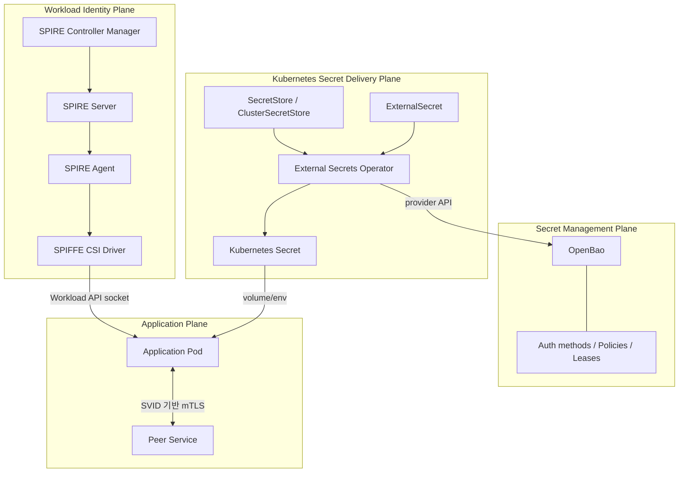
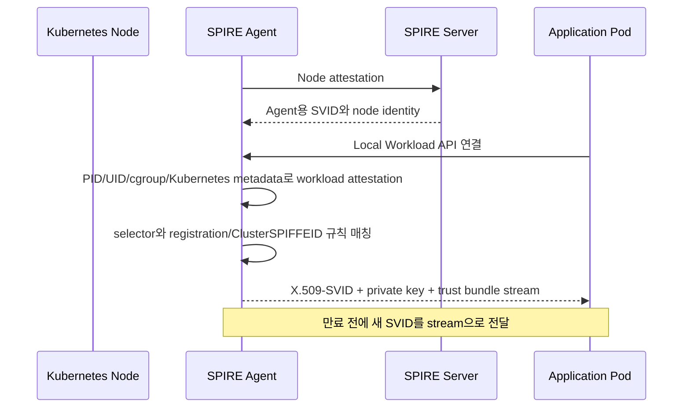
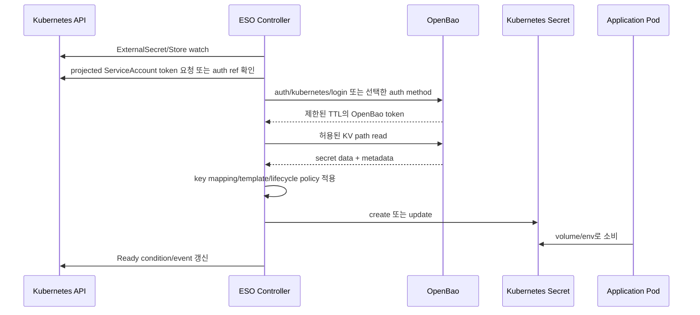

# SPIFFE/SPIRE, OpenBao, ESO 통합 설계와 선택 기준

이 문서는 각 제품의 설치법을 반복하지 않습니다. 대신 실제 플랫폼을 설계할 때 **어떤 문제를 어느 구성 요소가 책임져야 하는지**, 어떤 연결은 현재 권장할 수 있고 어떤 연결은 실험으로 남겨야 하는지를 정리합니다.

기준 시점은 **2026-08-17**입니다. 현재 TwinX 상태를 언급하는 부분은 [2026-06-28 OpenBao sealed 복구 기록](../twinx-openbao-sealed-recovery-2026-06-28.md)에 관측된 사실을 기준으로 하며, 지금도 동일하다는 뜻은 아닙니다.

## 학습 목표

이 문서를 읽은 뒤에는 다음 결정을 설명할 수 있어야 합니다.

- SVID, Kubernetes ServiceAccount token, OpenBao token, Kubernetes `Secret` 중 무엇을 어디에 사용할지
- SPIFFE/SPIRE와 OpenBao/ESO가 겹치지 않는 책임 경계
- 애플리케이션이 secret을 직접 가져올지 ESO가 동기화할지
- `SecretStore`와 `ClusterSecretStore` 중 무엇을 선택할지
- 한 클러스터/다중 클러스터에서 trust domain과 secret path를 어떻게 나눌지
- GitOps repository에 넣어도 되는 것과 절대 넣으면 안 되는 것
- 장애가 identity plane, secret management plane, delivery plane, application plane 중 어디에 있는지

## 1. 네 가지 문제를 먼저 분리한다

| 계층 | 핵심 질문 | 대표 기술 | 결과물 |
| --- | --- | --- | --- |
| Workload identity | 이 프로세스/Pod는 누구인가? | SPIFFE/SPIRE | SPIFFE ID와 SVID |
| Authentication | 상대가 그 identity의 소유자임을 어떻게 증명하는가? | X.509-SVID mTLS, JWT-SVID, Kubernetes token | 검증된 주체 |
| Authorization | 검증된 주체가 무엇을 할 수 있는가? | 애플리케이션 ACL, proxy policy, OpenBao policy, Kubernetes RBAC | 허용/거부 결정 |
| Secret management/distribution | 비밀값을 어디에서 만들고 누구에게 어떻게 전달하는가? | OpenBao, ESO, Kubernetes `Secret` | credential 또는 secret material |

한 제품으로 네 문제를 모두 해결하려고 하면 다음 문제가 생깁니다.

- identity credential과 업무용 secret의 lifecycle이 섞입니다.
- 인증 성공이 곧 인가 성공으로 오해됩니다.
- 하나의 cluster-scoped credential에 지나치게 넓은 권한이 집중됩니다.
- 장애 원인을 분리하기 어려워집니다.
- 회전 주기와 폐기 단위가 서로 다른 값을 같은 경로로 다루게 됩니다.

## 2. 권장 책임 경계



### SPIFFE/SPIRE가 책임질 것

- workload를 namespace, ServiceAccount, UID, binary 속성 등으로 attestation
- 정책에 맞는 SPIFFE ID 부여
- 짧은 수명의 X.509-SVID/JWT-SVID와 trust bundle 발급·회전
- local Workload API를 통한 credential 전달
- federation이 명시된 trust domain 사이의 bundle 교환

### OpenBao가 책임질 것

- static KV secret의 암호화 저장
- database credential, PKI certificate 같은 동적 secret 발급
- auth method를 통한 client 인증
- path 기반 policy와 capability 적용
- token/lease TTL, renewal, revocation
- audit device를 통한 요청 추적
- storage/HA/seal/recovery lifecycle

### ESO가 책임질 것

- 선언된 CR을 감시하고 provider 상태를 reconcile
- OpenBao의 값을 Kubernetes `Secret` 형태로 변환
- key mapping, `dataFrom`, rewrite, template 적용
- refresh/creation/deletion policy에 따른 target lifecycle 관리
- status condition, event, metric으로 sync 결과 표시

### 애플리케이션 또는 정책 계층이 책임질 것

- “`spiffe://lab.example.org/ns/payments/sa/api`는 결제 조회만 허용” 같은 업무 인가
- SVID/secret 회전을 따라가는 client reload
- 상대 identity와 audience 검증
- secret을 log, metric, error response에 노출하지 않기
- credential 사용 후 적절히 폐기하기

## 3. 세 가지 핵심 흐름

### 3.1 SPIRE가 workload identity를 발급하는 흐름



중요한 검증점:

1. Agent 자체가 먼저 Server에 node로 attestation 되었는가?
2. workload가 연결한 local socket이 올바른 Agent endpoint인가?
3. attestor가 얻은 selector가 등록 규칙과 일치하는가?
4. 발급된 SPIFFE ID가 의도한 trust domain/path인가?
5. 애플리케이션이 갱신 stream을 계속 소비하는가?
6. 상대 서비스가 올바른 bundle과 expected identity로 검증하는가?

### 3.2 ESO가 OpenBao 값을 Kubernetes Secret으로 동기화하는 흐름



이 흐름에는 서로 다른 credential이 존재합니다.

- Kubernetes ServiceAccount token: ESO가 자신을 Kubernetes/OpenBao에 증명할 때 사용
- OpenBao token: auth method 성공 후 provider API를 호출할 때 사용
- 원본 secret: OpenBao에 저장된 업무용 값
- target Kubernetes `Secret`: ESO가 만든 배포용 복사본
- 애플리케이션 프로세스 내부 값: volume/env를 읽은 뒤의 최종 노출 지점

따라서 “OpenBao에 안전하게 저장했으니 끝”이 아닙니다. target `Secret`의 etcd 암호화, namespace RBAC, Pod exec 권한, node 접근, application log도 함께 통제해야 합니다.

### 3.3 애플리케이션이 SPIRE와 ESO를 동시에 사용하는 흐름

대표적인 현실적 조합은 다음과 같습니다.

1. 애플리케이션은 SPIRE Workload API에서 X.509-SVID를 가져옵니다.
2. 서비스 간 통신은 SVID 기반 mTLS로 peer workload identity를 확인합니다.
3. 데이터베이스가 SPIFFE를 직접 지원하지 않는다면 DB password는 OpenBao에 둡니다.
4. ESO가 그 password를 namespace의 Kubernetes `Secret`으로 동기화합니다.
5. 애플리케이션은 file volume을 watch하거나 재시작 정책을 통해 회전을 반영합니다.
6. 애플리케이션 내부 authorization은 SPIFFE ID와 업무 정책을 연결합니다.

이 패턴에서 SVID와 DB password는 모두 credential이지만 목적과 lifecycle이 다릅니다.

- SVID: workload identity 증명, 짧은 TTL, 자동 rotation, private key는 workload 근처에서 생성/보관
- DB password: 외부 시스템 접근, DB/secret engine 정책과 rotation 주기에 종속

## 4. 무엇을 선택할지 결정하는 표

### 4.1 SVID, ServiceAccount token, OpenBao token, Kubernetes Secret

| 선택지 | 적합한 용도 | 장점 | 주요 위험/한계 |
| --- | --- | --- | --- |
| X.509-SVID | 서비스 간 mTLS, 양방향 workload 인증 | 짧은 TTL, 자동 회전, 표준 TLS와 결합 | 애플리케이션/sidecar가 Workload API와 reload를 지원해야 함 |
| JWT-SVID | HTTP bearer, message/queue처럼 mTLS가 어려운 경로 | 전달과 검증이 단순 | replay 위험, audience 검증 필수, 폐기는 만료에 의존 |
| projected ServiceAccount token | Kubernetes/OpenBao Kubernetes auth | 짧은 TTL, audience 지정, TokenReview 가능 | cluster와 ServiceAccount 경계에 종속 |
| OpenBao token | OpenBao API 호출 | policy/TTL/lease/renewal/revocation 적용 | token 노출 시 허용된 path 접근 가능 |
| Kubernetes `Secret` | 기존 앱에 파일/env로 값 주입 | Kubernetes 생태계와 호환, 앱 변경 적음 | etcd/node/Pod/exec 표면에 복사본이 생김 |
| OpenBao API 직접 호출 | dynamic secret, Kubernetes `Secret` 복사 최소화 | 짧은 lease와 즉시 revocation 활용 가능 | 앱 또는 agent 통합, renewal와 장애 처리 필요 |

### 4.2 ESO를 사용할지 직접 OpenBao를 호출할지

| 조건 | ESO 동기화 선호 | 직접 API/agent 선호 |
| --- | --- | --- |
| 기존 앱이 Kubernetes `Secret`만 지원 | 강함 | 앱 수정 필요 |
| 초 단위 dynamic credential | 제한적/별도 generator 검증 | 강함 |
| secret 복사본 최소화 | 불리 | 유리 |
| GitOps 선언과 상태 가시성 | 유리 | 별도 운영 계층 필요 |
| lease renewal/revocation 즉시성 | provider/reconcile에 종속 | 유리하지만 구현 책임 증가 |
| template/key mapping | ESO가 편리 | 앱 코드 필요 |
| 장애 시 fallback | 기존 `Secret`이 남을 수 있음 | OpenBao 가용성에 직접 종속될 수 있음 |

### 4.3 `SecretStore`와 `ClusterSecretStore`

| 기준 | `SecretStore` | `ClusterSecretStore` |
| --- | --- | --- |
| scope | namespace | cluster |
| 기본 blast radius | 작음 | 큼 |
| namespace별 policy 분리 | 자연스러움 | 추가 admission/RBAC 설계 필요 |
| 중복 설정 | 많을 수 있음 | 중앙화 가능 |
| platform 공통 provider | namespace마다 배포 필요 | 편리 |
| 권장 기본값 | tenant/application namespace | 엄격히 관리되는 공통 platform use case만 |

**“중복이 적다”는 이유만으로 `ClusterSecretStore`를 선택하지 않습니다.** store가 넓게 공유되면 각 namespace의 `ExternalSecret` 작성자가 provider credential이 읽을 수 있는 다른 path를 요청할 수 있는지까지 검토해야 합니다.

## 5. ESO가 OpenBao에 인증하는 방법

### 5.1 Kubernetes auth — Kubernetes 내부 기본 후보

흐름:

1. ESO용 ServiceAccount에 짧은 수명의 projected token을 발급합니다.
2. token의 audience가 OpenBao auth role/config와 일치해야 합니다.
3. ESO가 OpenBao Kubernetes auth login endpoint에 JWT를 제출합니다.
4. OpenBao는 TokenReview를 사용해 token과 ServiceAccount binding을 검증합니다.
5. OpenBao role이 namespace/ServiceAccount를 policy에 매핑합니다.
6. OpenBao는 제한된 TTL과 policy를 가진 token을 반환합니다.

장점:

- Kubernetes lifecycle과 자연스럽게 연결됩니다.
- static AppRole `SecretID`를 bootstrap secret으로 보관하지 않아도 됩니다.
- TokenReview를 사용하면 object 삭제/권한 변화와 더 잘 연동할 수 있습니다.

주의점:

- OpenBao가 Kubernetes API의 TokenReview endpoint에 접근할 권한과 network path가 필요합니다.
- issuer, audience, CA, API server 주소가 맞아야 합니다.
- 모든 namespace가 같은 OpenBao role을 공유하면 경계가 약해집니다.
- 오래된 자동 생성 ServiceAccount token Secret을 전제로 하지 않습니다.

### 5.2 AppRole — Kubernetes 밖 또는 명시적 machine bootstrap

AppRole은 `RoleID`와 `SecretID`를 사용합니다.

- `RoleID`는 식별자에 가깝고 상대적으로 덜 민감합니다.
- `SecretID`는 비밀값이며 전달·보관·회전 문제가 다시 생깁니다.
- `secret_id_ttl`, `secret_id_num_uses`, `token_ttl`, `token_max_ttl`, `token_num_uses`를 제한합니다.
- Kubernetes 내부에서 단지 익숙하다는 이유로 AppRole을 선택하면 bootstrap paradox가 커질 수 있습니다.

### 5.3 Static token — 실습 외에는 매우 제한적으로

- 구현은 단순하지만 장기 token의 배포·회전·회수가 어렵습니다.
- root token을 provider token으로 사용하면 안 됩니다.
- 사용해야 한다면 짧은 TTL, 최소 policy, 별도 namespace `Secret`, 엄격한 RBAC와 rotation을 적용합니다.

### 5.4 JWT/OIDC와 UserPass

- JWT/OIDC는 issuer/audience/claim binding을 정확히 설계해야 합니다.
- OpenBao의 Kubernetes-as-OIDC/JWT 검증은 TokenReview를 사용하지 않으므로 token이 폐기되어도 만료 전까지 유효할 수 있습니다.
- UserPass는 사람 또는 legacy workflow에 가까우며 Kubernetes controller의 기본 선택으로 권장하지 않습니다.

### 5.5 전용 OpenBao provider와 Vault provider

2026-08-17 기준 공식 ESO 문서에서 다음을 분리해야 합니다.

- 전용 OpenBao provider는 alpha로 표시됩니다.
- 명시적 시험 조합은 ESO `v0.16.1`, OpenBao `v2.2.0`입니다.
- 전용 provider는 KV backend와 AppRole/Kubernetes/token/UserPass auth를 문서화합니다.
- 더 넓은 Vault-style auth surface는 HashiCorp Vault provider 문서에 있습니다.
- OpenBao의 Vault API compatibility는 유용하지만 **완전한 feature/version parity 보장**은 아닙니다.

따라서 provider 선택 ADR에는 최소한 다음을 남깁니다.

```text
provider kind:
ESO version/chart:
OpenBao version:
auth method:
secret engine/path:
officially documented combination:
compatibility-based assumptions:
integration test evidence:
rollback provider/config:
```

## 6. SPIFFE credential을 OpenBao 인증에 바로 쓸 수 있는가

### 결론

**기본 설계에서는 직접 연결을 전제하지 않습니다.**

SPIFFE JWT-SVID나 X.509-SVID를 다른 시스템의 인증 credential로 연결하는 것은 기술적으로 설계할 수 있지만, 다음이 모두 확인되어야 합니다.

- OpenBao auth method가 해당 형식과 issuer/trust bundle을 명시적으로 검증하는가?
- SPIFFE ID가 OpenBao policy/role에 안전하게 매핑되는가?
- audience와 replay 방어가 있는가?
- SVID rotation을 client와 auth backend가 따라가는가?
- ESO가 그 auth method를 공식적으로 지원하는가?
- 장애 시 Kubernetes auth/AppRole 등 검증된 fallback이 있는가?

현재 자료의 공식 근거만으로는 **“ESO가 SPIFFE SVID로 OpenBao에 로그인하는 구성”을 지원되는 기본 패턴이라고 단정하지 않습니다.** 실험하려면 별도 PoC, threat model, compatibility matrix, failure test가 필요합니다.

### 혼동하지 말아야 할 것

- SPIFFE OIDC Discovery Provider 같은 변환/호환 계층이 있다고 해서 모든 OIDC consumer가 안전하게 SPIFFE semantics를 보존하는 것은 아닙니다.
- X.509 certificate를 받는 auth method가 있다고 해서 X.509-SVID의 SPIFFE ID와 trust domain을 올바르게 authorization에 사용하는 것은 아닙니다.
- “JWT 형식”이라는 공통점만으로 Kubernetes ServiceAccount JWT와 JWT-SVID를 바꿔 쓸 수 없습니다.

## 7. 권장 배포 패턴

### Pattern A — 현재 적용하기 쉬운 기본형

```text
SPIRE -> workload SVID -> service-to-service mTLS
OpenBao -> ESO(Kubernetes auth) -> namespace Secret -> application
```

적합한 상황:

- 기존 앱이 Kubernetes `Secret`을 소비합니다.
- 서비스 간 identity와 DB/API credential을 모두 개선하려고 합니다.
- 애플리케이션을 한 번에 크게 바꾸기 어렵습니다.

보안 조건:

- namespace별 `SecretStore` 또는 path가 제한된 role
- projected ServiceAccount token
- target `Secret` RBAC와 etcd encryption
- SVID와 secret reload 시험
- OpenBao/ESO/SPIRE 각각의 alert

### Pattern B — dynamic secret 직접 소비형

```text
SPIRE -> workload identity/mTLS
Application or trusted agent -> OpenBao API -> short-lived DB credential
```

적합한 상황:

- database engine의 짧은 lease와 즉시 revocation이 중요합니다.
- 애플리케이션/agent가 renewal와 reconnect를 구현할 수 있습니다.
- Kubernetes `Secret` 복사본을 줄이고 싶습니다.

추가 책임:

- OpenBao auth bootstrap
- lease renewal/revocation
- OpenBao 일시 장애 시 cache/fail-closed 정책
- credential 갱신 중 connection pool 교체

### Pattern C — sidecar/proxy가 identity를 소비

애플리케이션이 Workload API를 직접 지원하지 않으면 검증된 proxy/sidecar가 SVID를 소비하고 애플리케이션 앞에서 mTLS를 종료할 수 있습니다.

장점:

- legacy 앱 변경을 줄입니다.
- identity 검증을 공통 계층에 모을 수 있습니다.

위험:

- localhost/plaintext 구간이 새 trust boundary가 됩니다.
- sidecar policy와 lifecycle이 복잡해집니다.
- proxy가 허용한 peer identity를 앱의 업무 권한으로 어떻게 전달할지 설계해야 합니다.

### Pattern D — 다중 클러스터 분리형

```text
TwinX trust domain  -> twinx.example.org
MiniX trust domain  -> minix.example.org
필요한 서비스만 SPIFFE federation

각 클러스터 OpenBao/ESO store 경계 분리
중앙 OpenBao를 쓸 경우 cluster별 auth mount/role/policy 분리
```

클러스터마다 trust domain을 나누면 compromise와 운영 책임 경계가 명확해집니다. 하나의 trust domain을 여러 클러스터에서 공유하면 identity path와 node attestation 정책, signing authority, 장애 blast radius를 공동으로 관리해야 합니다.

## 8. 다중 클러스터 설계 질문

### trust domain을 하나로 합칠 때

장점:

- 서비스 identity namespace가 단순합니다.
- cross-cluster mTLS policy가 비교적 간단합니다.

위험:

- 한 클러스터의 registration/attestation 오류가 전체 identity namespace에 영향을 줄 수 있습니다.
- signing authority와 운영 권한이 강하게 결합됩니다.
- 같은 SPIFFE path를 중복 발급하지 않도록 중앙 통제가 필요합니다.

### trust domain을 분리하고 federation할 때

장점:

- 독립적인 root of trust와 운영 경계
- 필요한 peer만 명시적으로 신뢰
- cluster compromise blast radius 축소

비용:

- bundle endpoint와 federation 관리
- authorization에서 여러 trust domain 처리
- network partition과 bundle refresh 실패 고려

### secret backend를 중앙화할 때

- cluster마다 별도 Kubernetes auth mount 또는 구분 가능한 role을 둡니다.
- role binding에 namespace와 ServiceAccount를 모두 제한합니다.
- OpenBao policy path도 cluster/tenant/app 계층으로 나눕니다.
- ESO controller credential이 다른 cluster path를 읽을 수 없는지 negative test를 합니다.
- 중앙 OpenBao 장애가 모든 cluster의 신규 sync/rotation을 막는다는 점을 SLO에 반영합니다.

예시 path 구조:

```text
secret/data/clusters/twinx/platform/...
secret/data/clusters/twinx/apps/trident/...
secret/data/clusters/minix/platform/...
secret/data/clusters/minix/apps/demo/...
```

KV v2 policy에서는 data path와 metadata path가 다르므로 공식 문법에 맞게 각각 최소 capability를 부여합니다.

```hcl
# 예시일 뿐이며 mount 이름과 실제 사용 API를 확인해야 한다.
path "secret/data/clusters/twinx/apps/trident/*" {
  capabilities = ["read"]
}

path "secret/metadata/clusters/twinx/apps/trident/*" {
  capabilities = ["read", "list"]
}
```

## 9. GitOps와 bootstrap paradox

### Git에 저장해도 되는 것

- SPIFFE ID 규칙과 selector
- trust domain 이름
- `ClusterSPIFFEID` 같은 registration CR
- OpenBao policy **내용**
- auth role의 namespace/ServiceAccount binding
- `SecretStore`/`ExternalSecret` manifest
- secret key의 **경로와 이름**
- Helm chart version과 non-secret values
- alert rule, dashboard, NetworkPolicy

### Git에 저장하면 안 되는 것

- root/recovery/unseal material
- OpenBao token/AppRole SecretID
- 실제 KV secret value
- SPIRE signing key와 SVID private key
- 운영 kubeconfig/client key
- secret을 base64로만 바꾼 값

### bootstrap paradox

ESO가 OpenBao에서 secret을 읽으려면 먼저 OpenBao에 인증해야 합니다. 이 최초 credential을 또 ESO로 만들 수는 없습니다.

해결 후보:

1. Kubernetes auth와 projected ServiceAccount token 사용
2. cloud/KMS/HSM 기반 workload identity/auth 사용
3. 제한된 bootstrap secret을 별도 안전 채널로 주입하고 즉시 회전

반대로 다음은 해결이 아닙니다.

- root token을 Git에 암호화하지 않은 채 저장
- 장기 token을 모든 namespace가 공유
- 같은 ESO가 자신이 필요한 bootstrap secret을 자기 자신으로 동기화

## 10. Threat model

### 보호할 자산

- SPIRE signing key와 trust bundle 무결성
- SVID private key
- OpenBao seal/recovery material
- OpenBao storage와 audit log
- provider auth credential
- 원본 secret과 target Kubernetes `Secret`
- registration entry, policy, role, store manifest의 무결성

### 공격자/오류 가정

- 한 namespace에서 임의 Pod를 만들 수 있는 tenant
- Pod exec와 Secret read 권한을 가진 과도한 RBAC 사용자
- node root 권한을 획득한 공격자
- Git repository write 권한을 악용한 공급망 공격
- 잘못된 selector/policy/store scope를 배포한 운영자
- network path에서 endpoint를 가장하려는 공격자
- 오래된 token 또는 JWT를 재사용하는 공격자

### 위협과 통제

| 위협 | 통제 | 남는 위험 |
| --- | --- | --- |
| 다른 Pod가 같은 identity를 획득 | namespace+ServiceAccount+Pod selector, admission/RBAC, node attestation | namespace/SA 생성권이 넓으면 사칭 가능 |
| Workload API socket 무단 접근 | CSI mount scope, Unix peer attestation, Pod security | node root compromise는 강한 공격자 |
| JWT replay | 짧은 TTL, strict audience, TLS, token 비저장 | 만료 전 탈취 token replay |
| 다른 tenant secret path 읽기 | namespace `SecretStore`, OpenBao policy, negative test | shared store/provider credential이 너무 넓으면 우회 가능 |
| target Secret 탈취 | RBAC, etcd encryption, node hardening, no exec, volume 최소화 | application/node compromise |
| OpenBao sealed/중단 | HA, auto-unseal 검토, alert, runbook, cached secret 정책 | 신규 sync와 rotation 지연 |
| SPIRE Server 중단 | HA server+shared datastore, Agent cache 특성 검증, alert | 새 registration/rotation 영향 |
| GitOps 오구성 | review, policy-as-code, dry-run, canary, rollback | 승인된 잘못된 정책 |
| 오래된 bundle/policy | refresh monitoring, versioned rollout, conformance test | network partition 동안 staleness |

## 11. 장애 격리 기준

| 관측 | 가장 먼저 볼 계층 | 첫 확인 |
| --- | --- | --- |
| Pod가 SVID를 못 받음 | identity plane | Agent/CSI socket, selector, registration, attestation log |
| SVID는 있으나 mTLS 실패 | app/authorization/trust | peer expected ID, bundle, clock, TLS error |
| `SecretStore Ready=False` | provider/auth | store condition, ESO log, OpenBao seal/auth 상태 |
| `ExternalSecret Ready=False`, store는 Ready | data/lifecycle | remote key/path/property, policy, template, target ownership |
| target Secret은 최신인데 앱은 이전 값 | application delivery | env vs volume, reload/restart, subPath mount |
| OpenBao Pod는 Ready인데 ESO 503 sealed | secret plane/probe | `bao status`, health probe semantics |
| 한 namespace만 secret 실패 | tenant policy/store | namespace RBAC, role/path binding, ExternalSecret spec |
| 모든 namespace가 동시에 실패 | shared dependency | OpenBao seal/availability, cluster store auth, ESO controller |

## 12. 현재 TwinX 사실에서 출발하는 단계적 적용안

기존 장애 기록에서 확인된 과거 상태:

- OpenBao가 standalone file storage와 Shamir seal 방식이었습니다.
- restart 뒤 `Initialized=true`, `Sealed=true`가 되어 ESO login이 실패했습니다.
- `ClusterSecretStore/openbao-cluster-store`가 존재했습니다.
- Kubernetes auth role 예시 이름은 `eso-trident`였습니다.
- sealed 상태도 readiness를 통과하도록 health endpoint code가 설정되어 있었습니다.

현재 상태는 다시 조사해야 합니다. 다음 단계를 순서대로 진행합니다.

### Phase 0 — inventory만 수행

- 실제 OpenBao/ESO/SPIRE version과 chart version 기록
- auth mount, role, policy, KV mount 목록을 **값 없이** 기록
- `SecretStore`/`ClusterSecretStore` 참조 namespace와 remote path 목록화
- target Secret을 읽을 수 있는 RBAC subject 목록화
- OpenBao seal/HA/storage/backup/audit 구성 확인
- SPIRE가 없다면 “미배포”로 명시하고 추측하지 않기

### Phase 1 — OpenBao/ESO 기반 안정화

- sealed를 정상으로 오해하게 하는 probe/alert 보완
- backup restore와 recovery/unseal 책임 분리
- Kubernetes auth를 projected token/TokenReview 기준으로 검증
- application/namespace별 최소 policy
- broad `ClusterSecretStore` 사용에 admission/RBAC guardrail 적용
- 원본 rotation부터 application reload까지 end-to-end test

### Phase 2 — SPIRE sandbox

- 운영과 분리된 trust domain으로 hardened Helm chart 설치
- Server/Agent/CSI/Controller Manager health와 metric 확인
- sample namespace/ServiceAccount만 identity 발급
- X.509-SVID rotation과 mTLS negative identity test
- 장애/cleanup 후 운영 적용 ADR 작성

### Phase 3 — 제한된 production pilot

- stateless 내부 서비스 두 개를 선택
- service-to-service mTLS에만 SPIFFE identity 적용
- 기존 DB/API secret 경로는 OpenBao/ESO로 유지
- authorization policy를 explicit SPIFFE ID allowlist로 작성
- SVID rotation, Agent restart, Server disruption을 canary에서 시험

### Phase 4 — 확대 또는 동적 secret 검토

- 관측 결과에 따라 namespace/service 범위 확대
- DB engine/PKI dynamic secret은 별도 PoC
- VaultDynamicSecret을 OpenBao와 쓸 경우 compatibility-based inference임을 ADR에 기록
- 다중 클러스터 federation은 단일 클러스터 운영 안정화 뒤 진행

## 13. 운영 반영 acceptance criteria

### Identity plane

- [ ] trust domain 소유자와 naming rule이 문서화됨
- [ ] node/workload attestation plugin과 selector가 threat model에 맞음
- [ ] 동일 identity를 획득하면 안 되는 Pod의 negative test가 통과함
- [ ] SVID rotation이 application restart 없이 반영되거나 명시적 restart 전략이 있음
- [ ] peer가 인증서 유효성뿐 아니라 expected SPIFFE ID를 검증함
- [ ] SPIRE Server HA/datastore backup 또는 허용된 outage 영향이 문서화됨
- [ ] Agent/CSI/socket 관련 alert와 runbook이 있음

### Secret plane

- [ ] OpenBao backup restore가 시험됨
- [ ] seal/recovery material 보관과 quorum 책임이 분리됨
- [ ] root token을 일상 운영에 사용하지 않음
- [ ] audit device가 활성화되고 log 접근이 제한됨
- [ ] auth role과 policy가 namespace/application path로 최소화됨
- [ ] token/lease TTL과 renewal 실패 동작이 검증됨

### ESO/delivery plane

- [ ] provider/version 조합을 명시적으로 시험함
- [ ] store scope와 controller class/RBAC 경계를 검토함
- [ ] refresh/creation/deletion policy를 서비스 owner가 승인함
- [ ] source 삭제 시 target 동작을 시험함
- [ ] target Secret rotation을 app이 실제로 반영함
- [ ] ESO metric/event/log 기반 alert가 있음
- [ ] OpenBao sealed, auth deny, missing key를 구분하는 runbook이 있음

## 14. 피해야 할 anti-pattern

1. 모든 workload에 같은 SPIFFE ID를 부여합니다.
2. trust domain을 DNS domain과 무조건 같아야 한다고 가정합니다.
3. 인증서 chain만 검증하고 expected SPIFFE ID를 확인하지 않습니다.
4. JWT-SVID의 `aud`를 검증하지 않습니다.
5. Workload API socket을 모든 Pod에 광범위하게 mount합니다.
6. root token 또는 unseal key를 Kubernetes `Secret`/Git에 넣습니다.
7. 하나의 OpenBao policy로 모든 application path를 읽게 합니다.
8. `ClusterSecretStore`가 편리하다는 이유로 tenant 전체에 공개합니다.
9. base64를 encryption으로 오해합니다.
10. ESO가 target Secret을 갱신하면 application도 자동으로 reload한다고 가정합니다.
11. OpenBao Pod `Ready=True`만 보고 unsealed라고 판단합니다.
12. OpenBao와 Vault의 API compatibility를 완전한 기능 동등성으로 해석합니다.
13. alpha provider를 production에 쓰면서 version compatibility test를 생략합니다.
14. SVID가 있으니 authorization policy가 필요 없다고 생각합니다.
15. SPIFFE JWT-SVID, Kubernetes JWT, OIDC access token을 모두 같은 JWT로 취급합니다.

## 15. 설계 검토 질문

아래 질문에 답하지 못하면 구현보다 설계 확인이 먼저입니다.

1. 보호하려는 구체적인 공격은 무엇인가?
2. workload identity의 최소 단위는 cluster/namespace/ServiceAccount/Pod 중 무엇인가?
3. 누가 registration/`ClusterSPIFFEID`를 수정할 수 있는가?
4. trust domain의 signing authority가 손상되면 어디까지 영향받는가?
5. peer는 어떤 SPIFFE ID를 허용하는가?
6. OpenBao auth role은 어느 namespace와 ServiceAccount를 허용하는가?
7. 그 role의 policy는 어느 path를 읽을 수 있는가?
8. `ExternalSecret` 작성자가 임의 remote key를 요청할 수 있는가?
9. target Secret을 읽을 수 있는 사람/ServiceAccount/Pod는 누구인가?
10. source secret 회전 후 실제 app 반영까지 최대 시간은 얼마인가?
11. OpenBao/SPIRE/ESO가 각각 30분 중단되면 기존 트래픽과 신규 배포는 어떻게 되는가?
12. 어떤 audit event로 누가 secret을 읽었는지 추적할 수 있는가?
13. cluster compromise 후 trust와 secret을 어떤 순서로 회전하는가?
14. rollback이 old credential을 다시 유효하게 만드는가?
15. 실험적/호환성 기반 부분은 어디이며 종료 조건은 무엇인가?

## 공식 자료

- [SPIFFE specifications](https://spiffe.io/docs/latest/spiffe-specs/)
- [SPIRE concepts](https://spiffe.io/docs/latest/spire-about/spire-concepts/)
- [Registering workloads](https://spiffe.io/docs/latest/deploying/registering/)
- [SPIFFE federation](https://spiffe.io/docs/latest/spiffe-specs/spiffe_federation/)
- [SPIRE scaling](https://spiffe.io/docs/latest/planning/scaling_spire/)
- [SPIRE hardened Helm recommendations](https://spiffe.io/docs/latest/spire-helm-charts-hardened-about/recommendations/)
- [ESO overview](https://external-secrets.io/)
- [ESO API specification](https://external-secrets.io/main/api/spec/)
- [ESO multi-tenancy](https://external-secrets.io/main/guides/multi-tenancy/)
- [ESO security best practices](https://external-secrets.io/latest/guides/security-best-practices/)
- [ESO OpenBao provider](https://external-secrets.io/main/provider/openbao/)
- [ESO Vault provider](https://external-secrets.io/latest/provider/hashicorp-vault/)
- [OpenBao migration/API compatibility policy](https://openbao.org/docs/policies/migration/)
- [OpenBao Kubernetes auth](https://openbao.org/docs/next/auth/kubernetes/)
- [OpenBao policies](https://openbao.org/docs/2.5.x/concepts/policies/)
- [Kubernetes Service Accounts](https://kubernetes.io/docs/concepts/security/service-accounts/)
- [Kubernetes TokenReview](https://kubernetes.io/docs/reference/kubernetes-api/authentication-resources/token-review-v1/)
- [Kubernetes RBAC](https://kubernetes.io/docs/reference/access-authn-authz/rbac/)
