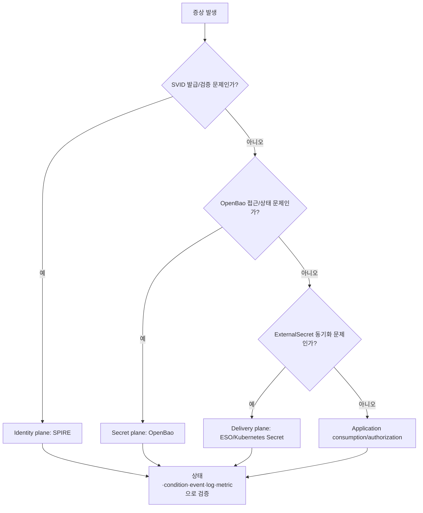

# Workload Identity와 Secret 운영·장애 대응·복습

이 문서는 SPIRE, OpenBao, External Secrets Operator(ESO)를 실제로 운영할 때 사용하는 진단 순서와 학습 평가 자료입니다. 특정 설치 이름이나 label을 무조건 가정하지 않고, 먼저 현재 리소스를 발견한 뒤 좁혀 가는 방식을 사용합니다.

> 가장 중요한 운영 원칙: **secret 값이나 private key를 출력하지 않고도 대부분의 장애는 상태, metadata, condition, event, policy, path, TTL, log만으로 진단할 수 있습니다.**

## 1. 장애를 네 계층으로 나누기



| 계층 | 정상의 최소 증거 | 대표 장애 |
| --- | --- | --- |
| SPIRE Server/Agent | Server/Agent Ready, node attestation 성공, workload registration 존재 | Agent 미등록, selector 불일치, datastore/CA 문제 |
| Workload API/CSI | Pod에서 endpoint 접근 가능, 예상 SPIFFE ID의 유효 SVID 수신 | socket 미마운트, 잘못된 권한, Agent 불가용 |
| OpenBao | `Initialized=true`, `Sealed=false`, active/standby 상태 정상 | sealed, storage/HA 문제, auth mount/role/policy 오류 |
| ESO store | `SecretStore` 또는 `ClusterSecretStore` `Ready=True` | provider config/auth/network/TLS 오류 |
| ExternalSecret | `Ready=True`, `SecretSynced` condition, target Secret 존재 | remote path/property/template/ownership 오류 |
| Application | 새 값/identity를 실제로 reload하고 요청 성공 | env 고정, `subPath`, connection pool, authorization 오류 |

## 2. 사고 대응 전에 지킬 것

### 절대 수집하지 않는 정보

- `kubectl get secret ... -o yaml` 전체 출력
- OpenBao token, unseal/recovery key
- `SecretID`, SVID private key
- 환경 변수 전체 dump
- application debug endpoint의 credential 포함 응답
- 운영 kubeconfig 내용

### 안전한 증거

- resource name, namespace, UID, generation, resourceVersion
- Ready condition의 status/reason/message
- event time/reason/message
- certificate subject/SAN/issuer/notBefore/notAfter **중 private key를 제외한 값**
- OpenBao initialized/sealed/HA 상태
- auth mount·role·policy 이름과 비밀이 아닌 설정
- controller/provider HTTP status와 오류 종류
- version, chart, image digest

### 사고 시간 기록

모든 시간은 timezone과 함께 기록합니다.

```bash
date --iso-8601=seconds
kubectl get --raw='/readyz?verbose'
```

clock skew는 X.509/JWT 검증과 lease 만료를 동시에 깨뜨릴 수 있습니다. node와 control plane의 시간 동기화도 확인 대상입니다.

## 3. 5분 baseline 수집

환경에 맞게 namespace만 지정합니다.

```bash
export LAB_SPIRE_NAMESPACE=spire-system
export LAB_OPENBAO_NAMESPACE=openbao
export LAB_ESO_NAMESPACE=external-secrets
```

### 클러스터와 CRD

```bash
kubectl version
kubectl get nodes -o wide
kubectl api-resources | rg -i 'spiffe|spire|external.?secret|secretstore|pushsecret'
kubectl get crd | rg -i 'spiffe|spire|external-secrets'
```

### SPIRE 관련 workload 발견

```bash
kubectl -n "$LAB_SPIRE_NAMESPACE" get deploy,daemonset,statefulset,pod -o wide
kubectl -n "$LAB_SPIRE_NAMESPACE" get service,endpoint,endpointslice
kubectl -n "$LAB_SPIRE_NAMESPACE" get event --sort-by=.lastTimestamp | tail -50
```

chart나 release에 따라 resource 이름이 다를 수 있으므로 먼저 목록을 보고 실제 이름을 사용합니다.

### OpenBao 상태

```bash
kubectl -n "$LAB_OPENBAO_NAMESPACE" get pod,service,pvc -o wide
kubectl -n "$LAB_OPENBAO_NAMESPACE" get event --sort-by=.lastTimestamp | tail -50
kubectl -n "$LAB_OPENBAO_NAMESPACE" exec openbao-0 -- sh -lc '
  export BAO_ADDR=http://127.0.0.1:8200
  bao status
'
```

`bao status`는 secret 값 없이 다음을 구분하는 핵심 명령입니다.

- initialized 여부
- sealed 여부
- seal type과 threshold/progress
- storage type
- HA enabled/active/standby 여부

### ESO와 custom resource

```bash
kubectl -n "$LAB_ESO_NAMESPACE" get deploy,pod,service -o wide
kubectl get secretstore -A
kubectl get clustersecretstore
kubectl get externalsecret -A
kubectl get clusterexternalsecret 2>/dev/null || true
kubectl get pushsecret -A 2>/dev/null || true
kubectl -n "$LAB_ESO_NAMESPACE" get event --sort-by=.lastTimestamp | tail -50
```

### 버전과 image 기록

```bash
kubectl -n "$LAB_SPIRE_NAMESPACE" get pod \
  -o custom-columns='NAME:.metadata.name,IMAGES:.spec.containers[*].image'
kubectl -n "$LAB_OPENBAO_NAMESPACE" get pod \
  -o custom-columns='NAME:.metadata.name,IMAGES:.spec.containers[*].image'
kubectl -n "$LAB_ESO_NAMESPACE" get pod \
  -o custom-columns='NAME:.metadata.name,IMAGES:.spec.containers[*].image'
helm list -A
```

## 4. SPIRE 진단 순서

### 4.1 Server가 정상인가

확인 항목:

1. Pod Ready와 restart count
2. datastore 연결
3. signing material 접근
4. node attestation request 처리
5. registration entry/CR reconcile
6. clock와 certificate validity

```bash
kubectl -n "$LAB_SPIRE_NAMESPACE" get pod -o wide
kubectl -n "$LAB_SPIRE_NAMESPACE" describe pod <SPIRE_SERVER_POD>
kubectl -n "$LAB_SPIRE_NAMESPACE" logs <SPIRE_SERVER_POD> \
  --all-containers --since=30m
```

log에서 우선 찾을 범주:

```text
attestation
datastore
registration
bundle
SVID
certificate
permission denied
deadline exceeded
```

`rg`로 좁힐 때도 log 전체를 외부에 붙여 넣기 전에 민감 metadata가 있는지 검토합니다.

```bash
kubectl -n "$LAB_SPIRE_NAMESPACE" logs <SPIRE_SERVER_POD> \
  --all-containers --since=30m \
  | rg -i 'error|attest|datastore|registration|bundle|svid|certificate|deadline'
```

### 4.2 Agent가 node로 attestation 되었는가

```bash
kubectl -n "$LAB_SPIRE_NAMESPACE" get daemonset,pod -o wide
kubectl -n "$LAB_SPIRE_NAMESPACE" describe pod <SPIRE_AGENT_POD>
kubectl -n "$LAB_SPIRE_NAMESPACE" logs <SPIRE_AGENT_POD> \
  --all-containers --since=30m
```

판단 질문:

- 실패가 모든 node인가, 특정 node인가?
- node attestor가 요구하는 metadata가 해당 node에 있는가?
- Server endpoint/DNS/TLS에 접근할 수 있는가?
- Agent data directory/identity가 중복 또는 stale하지 않은가?
- node 삭제·재조인 뒤 이전 registration/attestation record가 남았는가?

### 4.3 workload selector가 규칙과 일치하는가

Kubernetes에서 흔히 사용하는 selector 후보:

- namespace
- ServiceAccount
- Pod UID 또는 label 기반 controller-generated rule
- container image 또는 node/workload attestor가 제공하는 속성

진단 절차:

1. 대상 Pod의 namespace와 ServiceAccount를 확인합니다.
2. SPIRE Controller Manager CR 또는 registration entry를 확인합니다.
3. 실제 attested selector를 Agent debug/API로 확인합니다.
4. 예상 SPIFFE ID와 parent ID를 비교합니다.

```bash
kubectl -n <APP_NAMESPACE> get pod <APP_POD> \
  -o custom-columns='NAME:.metadata.name,SA:.spec.serviceAccountName,UID:.metadata.uid,NODE:.spec.nodeName'

kubectl get clusterspiffeid -A 2>/dev/null || true
kubectl get clusterspiffeid <RULE_NAME> -o yaml 2>/dev/null || true
```

CR 전체 YAML에는 일반적으로 secret 값이 없어야 하지만, annotation/embedded config에 민감값이 없는지 확인한 뒤 공유합니다.

### 4.4 Workload API endpoint가 보이는가

확인할 것:

- CSI inline volume 또는 명시한 socket volume이 Pod spec에 존재
- mount path가 애플리케이션 설정과 일치
- socket file type/permission
- `SPIFFE_ENDPOINT_SOCKET` 값
- 해당 node의 Agent/CSI driver가 Ready

```bash
kubectl -n <APP_NAMESPACE> get pod <APP_POD> -o jsonpath='{.spec.volumes}'
kubectl -n <APP_NAMESPACE> exec <APP_POD> -- sh -lc '
  printf "SPIFFE_ENDPOINT_SOCKET=%s\n" "${SPIFFE_ENDPOINT_SOCKET:-unset}"
  test -S /run/spire/sockets/agent.sock && echo socket-present || echo socket-missing
'
```

실제 chart의 socket path가 다르면 먼저 Pod spec에서 찾아 사용합니다. socket을 임의의 다른 Pod에 mount해 시험하지 않습니다.

### 4.5 SVID를 안전하게 검사하기

SPIRE CLI/API helper의 정확한 subcommand는 설치 버전에서 `--help`로 확인합니다.

```bash
kubectl -n "$LAB_SPIRE_NAMESPACE" exec <SPIRE_AGENT_POD> -- \
  /opt/spire/bin/spire-agent api fetch x509 -help
```

검사할 필드:

- SPIFFE ID URI SAN
- issuer/chain
- notBefore/notAfter
- trust bundle의 trust domain
- 갱신 전후 serial/expiry 변화

private key의 PEM 내용을 출력하거나 사고 기록에 저장하지 않습니다.

### 4.6 mTLS가 실패할 때

| 오류 종류 | 가능성 | 확인 |
| --- | --- | --- |
| unknown authority | 잘못된/오래된 bundle | peer trust domain과 bundle source |
| certificate expired/not yet valid | rotation 실패 또는 clock skew | SVID validity와 node time |
| identity unauthorized | TLS는 성공했지만 expected SPIFFE ID 불일치 | authorization policy/allowlist |
| socket unavailable | CSI/Agent/mount 문제 | Pod volume, Agent/CSI Ready |
| no matching workload | selector/registration 불일치 | attested selector와 rule |
| intermittent failures | 일부 node Agent, HA endpoint, rotation reload | 실패 Pod/node 상관관계 |

## 5. OpenBao 진단 순서

### 5.1 initialized와 sealed를 먼저 구분

| 상태 | 의미 | 행동 |
| --- | --- | --- |
| `Initialized=false` | 새 storage이거나 data path를 잃었을 수 있음 | 원인 확인 전 init 금지 |
| `Initialized=true`, `Sealed=true` | data는 있으나 barrier가 잠김 | 기존 recovery/unseal 절차 사용 |
| `Initialized=true`, `Sealed=false` | 요청 처리 가능 상태 | auth/policy/path 진단으로 이동 |

`Initialized=true`인 기존 storage에 `bao operator init`을 다시 시도하지 않습니다.

### 5.2 Pod Ready만 믿지 않기

health probe가 `sealedcode=204`를 허용하면 sealed 인스턴스도 Ready일 수 있습니다.

```bash
kubectl -n "$LAB_OPENBAO_NAMESPACE" get pod openbao-0 -o jsonpath='{.spec.containers[*].readinessProbe}'
kubectl -n "$LAB_OPENBAO_NAMESPACE" exec openbao-0 -- sh -lc '
  export BAO_ADDR=http://127.0.0.1:8200
  bao status
'
```

### 5.3 network/TLS인가 auth인가

증상을 순서대로 분리합니다.

1. DNS resolution
2. TCP connection
3. TLS chain/hostname
4. auth endpoint existence
5. ServiceAccount JWT/TokenReview
6. role binding
7. policy capability
8. secret engine path/version

예상 오류 의미:

| HTTP/오류 | 우선 해석 |
| --- | --- |
| connection refused/timeout | Service, NetworkPolicy, endpoint, Pod 상태 |
| TLS unknown authority/name mismatch | CA bundle 또는 server name |
| `503 Vault is sealed` | OpenBao sealed |
| `403 permission denied` at login | auth role/JWT/audience/binding/TokenReview |
| login 성공 후 KV `403` | OpenBao policy/path/capability |
| KV `404` | mount/path/version/property 불일치 또는 값 없음 |

### 5.4 policy는 허용과 거부를 모두 시험

정상 경로 read 성공만으로 least privilege를 증명할 수 없습니다.

- 허용 경로가 읽히는가?
- sibling app/tenant path가 거부되는가?
- list가 필요하지 않은데 허용되어 있지 않은가?
- KV v2 data/metadata path capability가 의도와 맞는가?
- delete/update가 read-only consumer에 허용되어 있지 않은가?

실제 secret 값은 출력하지 말고 HTTP status/capability 결과만 기록합니다.

### 5.5 token과 lease

운영 token을 출력하지 않고 다음 metadata를 확인합니다.

- TTL과 max TTL
- renewable 여부
- attached policy 이름
- orphan/parent 관계
- token/lease가 만료되었을 때 client 재로그인 동작
- OpenBao 일시 중단 중 cached target Secret을 계속 사용할지

root token은 진단 편의를 위한 일반 운영 credential이 아닙니다.

## 6. ESO 진단 순서

### 6.1 Store condition부터 보기

```bash
kubectl -n <APP_NAMESPACE> describe secretstore <STORE_NAME>
kubectl describe clustersecretstore <CLUSTER_STORE_NAME>
```

condition만 간단히 수집:

```bash
kubectl -n <APP_NAMESPACE> get secretstore <STORE_NAME> \
  -o jsonpath='{range .status.conditions[*]}{.type}{"="}{.status}{" reason="}{.reason}{" message="}{.message}{"\n"}{end}'
```

Store가 Ready가 아니면 `ExternalSecret` template부터 고치지 않습니다. provider/auth 문제를 먼저 해결합니다.

### 6.2 ExternalSecret generation과 condition

```bash
kubectl -n <APP_NAMESPACE> get externalsecret <EXTERNAL_SECRET_NAME> \
  -o custom-columns='NAME:.metadata.name,GEN:.metadata.generation,OBSERVED:.status.conditions[0].observedGeneration,READY:.status.conditions[0].status,REASON:.status.conditions[0].reason,REFRESH:.status.refreshTime'

kubectl -n <APP_NAMESPACE> describe externalsecret <EXTERNAL_SECRET_NAME>
```

확인 순서:

1. referenced store 이름과 kind가 맞는가?
2. `remoteRef.key`가 provider의 logical path 규칙과 맞는가?
3. KV v2인데 `/data/`를 중복으로 넣지 않았는가?
4. `property`가 실제 JSON key와 맞는가?
5. decoding/conversion/rewrite/template 오류가 있는가?
6. target Secret ownership이 다른 controller와 충돌하는가?
7. `refreshPolicy` 때문에 의도적으로 다시 읽지 않는 상태인가?
8. source key 삭제와 `deletionPolicy`의 조합이 기대와 같은가?

### 6.3 ESO controller log

먼저 실제 deployment 이름을 확인합니다.

```bash
kubectl -n "$LAB_ESO_NAMESPACE" get deploy
kubectl -n "$LAB_ESO_NAMESPACE" logs deploy/<ESO_DEPLOYMENT> \
  --all-containers --since=30m \
  | rg -i 'error|secretstore|externalsecret|provider|reconcile|denied|sealed|timeout'
```

log를 공유할 때 remote secret의 값이 포함되지 않았는지 검토합니다.

### 6.4 안전하게 reconcile 유도

일반적으로 다음 refresh를 기다리는 것이 우선입니다. 즉시 reconcile이 필요하면 공식 문서/현재 controller가 지원하는 annotation을 확인한 뒤 timestamp를 갱신합니다.

```bash
kubectl -n <APP_NAMESPACE> annotate externalsecret <EXTERNAL_SECRET_NAME> \
  force-sync="$(date +%s)" --overwrite
```

GitOps diff를 원치 않으면 검증 후 임시 annotation을 제거합니다.

```bash
kubectl -n <APP_NAMESPACE> annotate externalsecret <EXTERNAL_SECRET_NAME> \
  force-sync- --overwrite
```

### 6.5 target Secret을 값 없이 확인

```bash
kubectl -n <APP_NAMESPACE> get secret <TARGET_SECRET_NAME> \
  -o custom-columns='NAME:.metadata.name,TYPE:.type,CREATED:.metadata.creationTimestamp,VERSION:.metadata.resourceVersion,OWNER:.metadata.ownerReferences[0].kind'

kubectl -n <APP_NAMESPACE> get secret <TARGET_SECRET_NAME> \
  -o go-template='{{range $key, $_ := .data}}{{$key}}{{"\n"}}{{end}}'
```

두 번째 명령은 **key 이름만** 보여주고 값은 출력하지 않습니다. key 이름 자체도 민감할 수 있는 환경에서는 공유하지 않습니다.

## 7. target Secret은 바뀌었는데 앱이 안 바뀌는 이유

ESO가 성공했다고 애플리케이션 반영까지 성공한 것은 아닙니다.

| 소비 방식 | update 특성 | 운영 대응 |
| --- | --- | --- |
| environment variable | 실행 중 container에는 자동 반영되지 않음 | controlled restart/rollout 필요 |
| Secret volume | kubelet이 결국 반영하지만 즉시는 아님 | propagation 지연과 app file watch 확인 |
| `subPath` mount | update를 받지 않음 | `subPath` 회피 또는 restart |
| app startup read only | 파일이 바뀌어도 메모리 값은 그대로 | reload 구현 또는 restart |
| connection pool credential | 새 값만 읽어도 기존 연결은 old credential | pool 재생성/dual credential window |

검증은 다음 세 단계를 분리합니다.

1. OpenBao source version이 바뀌었는가?
2. Kubernetes target Secret resourceVersion이 바뀌었는가?
3. application이 새 credential로 실제 요청에 성공하는가?

## 8. 자주 발생하는 장애 시나리오

### Scenario A — 모든 ExternalSecret이 동시에 실패

우선순위:

1. ESO controller availability
2. shared `ClusterSecretStore` condition
3. OpenBao sealed/availability
4. Kubernetes auth/TokenReview
5. network/DNS/TLS

한 앱의 remote key를 먼저 수정하지 않습니다. 공통 의존성 장애일 가능성이 큽니다.

### Scenario B — 특정 namespace만 실패

우선순위:

1. `SecretStore`와 ServiceAccount reference
2. OpenBao role의 bound namespace/ServiceAccount
3. namespace RBAC
4. remote path policy
5. ExternalSecret template/target ownership

### Scenario C — OpenBao Pod restart 뒤 ESO 503

```bash
kubectl -n "$LAB_OPENBAO_NAMESPACE" exec openbao-0 -- sh -lc '
  export BAO_ADDR=http://127.0.0.1:8200
  bao status
'
```

`Initialized=true`, `Sealed=true`라면 기존 승인된 unseal/recovery 절차를 따릅니다. 새로 init하지 않습니다. 자세한 복구는 [기존 TwinX 기록](../twinx-openbao-sealed-recovery-2026-06-28.md)을 봅니다.

### Scenario D — Store Ready지만 remote key 404

확인:

- KV mount 이름
- KV version
- logical key와 API `/data/` path 혼동
- namespace/path prefix
- property 이름
- 값의 삭제/undelete/destroy 상태

ESO provider가 logical path를 조립하는 경우 `remoteRef.key`에 `/v1/` 또는 `/data/`를 직접 넣으면 중복될 수 있습니다.

### Scenario E — SPIRE Agent 일부 node만 실패

확인:

- 실패 Pod가 같은 node에 몰리는가?
- 해당 Agent/CSI Pod 상태와 socket hostPath
- node attestation selector/label
- node clock/network/DNS
- 재조인한 node의 stale identity

### Scenario F — mTLS는 연결되지만 요청이 거부

TLS와 authorization을 분리합니다.

- peer certificate chain과 SPIFFE ID 검증은 성공했는가?
- authorization policy가 정확한 SPIFFE ID를 허용하는가?
- proxy가 identity를 앱에 안전하게 전달하는가?
- namespace/ServiceAccount 변경으로 SPIFFE ID path가 바뀌지 않았는가?

### Scenario G — rotation 뒤 간헐적 실패

확인:

- client/server 중 한쪽만 새 bundle/SVID를 사용 중인가?
- 애플리케이션이 stream update 대신 시작 시 한 번만 읽는가?
- 다중 replica 중 일부만 reload했는가?
- clock skew로 validity window가 겹치지 않는가?
- DB credential rotation에서 old/new overlap이 충분한가?

## 9. 관측과 alert 설계

metric 이름은 버전에 따라 변할 수 있으므로 공식 telemetry 문서와 실제 `/metrics`를 기준으로 discovery합니다.

```bash
kubectl -n "$LAB_ESO_NAMESPACE" port-forward service/<ESO_METRICS_SERVICE> 18080:<METRICS_PORT>
curl -fsS http://127.0.0.1:18080/metrics \
  | rg -i 'external.?secret|provider|reconcile|condition|error'
```

동일하게 SPIRE/OpenBao metric endpoint와 ServiceMonitor를 현재 chart에서 확인합니다.

### 반드시 관측할 signal

#### SPIRE

- Server/Agent/CSI/Controller Manager replica availability
- node attestation 성공/실패
- SVID 발급/갱신 실패와 latency
- datastore error/latency
- bundle/federation refresh 실패
- Workload API error
- certificate expiry headroom

#### OpenBao

- initialized/sealed 상태
- active/standby와 HA peer
- request/error/latency
- auth 실패율과 permission denied 증가
- token/lease creation, expiry, renewal, revocation 실패
- storage latency/error
- audit device failure
- disk/PVC capacity와 backup freshness

#### ESO

- controller leader/replica 상태
- reconcile 성공/실패/지연
- provider call error/latency
- `SecretStore`/`ClusterSecretStore` Ready false
- `ExternalSecret` Ready false와 last refresh age
- source/target 삭제 event
- workqueue depth/retry 증가

#### Application

- credential expiry까지 남은 시간
- mTLS handshake error를 reason별 분류
- expected SPIFFE ID authorization deny
- DB/API authentication error
- secret reload 성공/실패와 마지막 반영 시각

### 추천 alert

| Alert | Warning | Critical |
| --- | --- | --- |
| OpenBao sealed | 즉시 | 즉시; 신규 sync/rotation 중단 |
| Store Ready false | 5분 지속 | 여러 namespace/공통 store 영향 |
| ExternalSecret stale | refresh interval의 2배 | credential expiry 임박 또는 다수 영향 |
| SPIRE Agent unavailable | 단일 node | 여러 node 또는 중요 workload 영향 |
| SVID expiry headroom | rotation window 접근 | 만료 임박/실패 |
| audit device failure | 즉시 조사 | 감사 공백 지속 시 변경 중단 |
| backup freshness | RPO 접근 | RPO 초과 |

임계값은 실제 refresh interval, SVID TTL, token TTL, SLO에서 계산합니다. 임의의 고정값을 복사하지 않습니다.

## 10. 정기 점검

### 매일

- [ ] OpenBao unsealed/HA 상태
- [ ] ESO store와 ExternalSecret Ready 상태
- [ ] SPIRE Server/Agent/CSI availability
- [ ] 최근 critical alert와 반복 permission deny
- [ ] credential expiry/refresh backlog

### 매주

- [ ] controller/operator restart와 OOM 추세
- [ ] 실패가 특정 node/namespace에 몰리는지
- [ ] stale/unused registration entry와 ExternalSecret
- [ ] audit log 수집 성공
- [ ] backup job 성공과 restore 가능한 artifact 존재

### 매월

- [ ] OpenBao policy와 Kubernetes RBAC least-privilege review
- [ ] `ClusterSecretStore` consumer 목록
- [ ] trust domain/SPIFFE ID naming drift
- [ ] SVID/secret rotation 실제 시험
- [ ] dependency release/security advisory 확인
- [ ] 복구 연락망과 recovery material 접근 절차 확인

### 분기별

- [ ] OpenBao restore rehearsal
- [ ] SPIRE Server/Agent failure exercise
- [ ] credential compromise tabletop
- [ ] federation/network partition test
- [ ] unused auth role/policy/store 제거 계획
- [ ] 문서 예제와 실제 CRD/version 재검증

## 11. 안전한 change plan

운영 반영 전 다음을 채웁니다.

```text
목표:
대상 cluster/namespace/workload:
현재 version/chart/image digest:
변경할 trust domain/SPIFFE ID/policy/store:
보호하려는 위협:
사전 backup/snapshot:
canary 대상:
정상 판정:
negative test:
중단 조건:
rollback 명령:
rollback 뒤 credential 유효성:
관측 dashboard/log:
승인자:
```

### 권장 중단 조건

- 예상하지 않은 workload가 SVID를 획득
- 다른 tenant의 remote path read 성공
- OpenBao audit event 누락
- rotation 뒤 app 인증 실패가 SLO 초과
- SPIRE/ESO/OpenBao controller rollback 불가
- backup restore 검증 실패
- target Secret 소유권 충돌로 GitOps drift 확대

## 12. Incident 기록 템플릿

```markdown
# <검색 가능한 제목과 날짜>

## 영향
- 시작/종료 시각과 timezone
- 영향 cluster/namespace/workload
- 기존 트래픽/신규 배포/rotation 각각의 영향

## 증상
- condition reason/message
- HTTP/gRPC 오류와 status
- secret 값이 아닌 상태 출력

## 진단
- identity / secret / delivery / application 중 어느 계층인가
- 실행한 정확한 명령
- 반증한 가설

## Root cause
- 직접 원인
- 구조적 원인
- 탐지가 늦어진 이유

## 복구
- 임시 조치
- 영구 조치
- secret/private key를 노출하지 않은 절차

## 검증
- positive test
- negative authorization test
- rotation/restart test

## 재발 방지
- policy/RBAC/admission
- alert/dashboard
- backup/restore
- owner와 기한

## 공개 문서 정리
- 제거한 민감정보
- version/환경 조건
```

## 13. 실습 과제

### 과제 1 — SPIFFE ID 설계

세 namespace `payments`, `catalog`, `observability`와 각 ServiceAccount를 위한 SPIFFE ID 규칙을 설계합니다.

제출물:

- trust domain 선택 이유
- path naming rule
- 같은 identity를 공유하면 안 되는 workload 목록
- allowed peer matrix
- namespace/ServiceAccount 변경 시 migration 방법

### 과제 2 — X.509-SVID와 JWT-SVID 선택

다음 통신마다 무엇을 선택할지 근거를 씁니다.

1. 내부 gRPC 양방향 통신
2. 외부 message queue가 bearer token만 지원
3. offline batch가 수 분 뒤 token을 사용
4. browser가 직접 호출

TTL, audience, replay, key custody, authorization을 포함합니다.

### 과제 3 — least-privilege OpenBao policy

`payments-api`가 자기 DB credential만 읽고 `catalog` path는 읽지 못하도록 policy와 negative test를 작성합니다.

### 과제 4 — Store scope 결정

플랫폼 공통 CA, tenant별 DB password, 공통 registry pull credential 각각에 `SecretStore`/`ClusterSecretStore` 중 무엇을 쓸지 정하고 blast radius를 설명합니다.

### 과제 5 — rotation 관찰

원본 KV 값을 test value A에서 B로 바꾸고 다음 시각을 기록합니다.

- OpenBao write 완료
- ESO refresh 시작/완료
- target Secret resourceVersion 변경
- volume update
- application 실제 반영

실제 값은 기록하지 않고 version/time만 기록합니다.

### 과제 6 — failure injection

lab에서만 다음을 하나씩 재현합니다.

- OpenBao sealed 또는 provider endpoint 차단
- 잘못된 Kubernetes auth role
- remote key 오타
- SPIRE selector 불일치
- 특정 node Agent 중단
- application이 old secret을 계속 사용

각 장애를 symptom → diagnosis → root cause → fix → prevention 형식으로 기록합니다.

## 14. 복습 문제

### 개념

1. SPIFFE와 SPIRE는 무엇이 다른가?
2. SPIFFE ID가 인증서 자체가 아닌 이유는 무엇인가?
3. trust domain은 어떤 경계를 나타내는가?
4. SVID와 trust bundle은 어떻게 연결되는가?
5. X.509-SVID와 JWT-SVID의 대표적인 차이는 무엇인가?
6. Workload API가 중앙 공개 API가 아닌 이유는 무엇인가?
7. node attestation과 workload attestation이 둘 다 필요한 이유는 무엇인가?
8. selector와 registration entry의 관계는 무엇인가?
9. authentication과 authorization은 왜 분리해야 하는가?
10. SPIFFE federation이 모든 identity를 자동 허용한다는 뜻이 아닌 이유는 무엇인가?

### OpenBao

11. initialized와 unsealed는 어떻게 다른가?
12. storage backend와 seal mechanism의 책임은 무엇이 다른가?
13. root token을 평상시 ESO credential로 쓰면 안 되는 이유는 무엇인가?
14. auth method와 secret engine은 어떻게 다른가?
15. policy capability는 어디에 적용되는가?
16. token TTL과 dynamic secret lease TTL은 왜 별도로 생각해야 하는가?
17. KV v2의 logical path와 API data/metadata path 차이가 왜 문제를 일으키는가?
18. Shamir seal deployment가 restart 뒤 운영 절차를 요구하는 이유는 무엇인가?
19. auto-unseal이 backup/DR을 자동 해결하지 않는 이유는 무엇인가?
20. audit log 자체도 보호해야 하는 이유는 무엇인가?

### ESO

21. ESO는 secret manager인가, 동기화 controller인가?
22. `ExternalSecret`과 target Kubernetes `Secret`은 어떤 관계인가?
23. `SecretStore`와 `ClusterSecretStore`의 가장 중요한 보안 차이는 무엇인가?
24. Store가 Ready가 아닌데 template부터 고치면 안 되는 이유는 무엇인가?
25. `refreshPolicy`가 source rotation 반영에 어떤 영향을 주는가?
26. `creationPolicy`와 `deletionPolicy`를 함께 검토해야 하는 이유는 무엇인가?
27. target Secret이 바뀌어도 env 기반 앱이 새 값을 못 보는 이유는 무엇인가?
28. `subPath` secret volume이 rotation과 맞지 않는 이유는 무엇인가?
29. 전용 OpenBao provider와 Vault provider를 구분해야 하는 이유는 무엇인가?
30. OpenBao API compatibility가 완전한 지원 보장이 아닌 이유는 무엇인가?

### 운영/설계

31. OpenBao Pod Ready인데 ESO가 sealed 오류를 낼 수 있는 이유는 무엇인가?
32. 여러 namespace가 동시에 실패하면 왜 shared store/OpenBao부터 확인하는가?
33. 정상 경로 read test만으로 least privilege를 증명할 수 없는 이유는 무엇인가?
34. SVID rotation과 application reload를 별도로 시험해야 하는 이유는 무엇인가?
35. Kubernetes auth와 JWT/OIDC auth의 TokenReview 차이는 무엇인가?
36. 중앙 OpenBao가 다중 클러스터 blast radius를 키우는 방식은 무엇인가?
37. cluster마다 trust domain을 나누면 얻는 장점과 비용은 무엇인가?
38. secret 값을 보지 않고 sync 성공을 증명할 방법은 무엇인가?
39. GitOps repository에 policy는 넣을 수 있지만 token은 넣으면 안 되는 이유는 무엇인가?
40. SPIFFE SVID로 OpenBao/ESO 인증이 자동 지원된다고 가정하면 안 되는 이유는 무엇인가?

## 15. 정답과 해설

1. SPIFFE는 규격이고 SPIRE는 그 규격을 구현하는 software입니다.
2. SPIFFE ID는 URI 식별자이고, SVID가 그 ID를 증명하는 X.509/JWT 문서입니다.
3. identity namespace와 그 identity를 검증할 trust root/운영 책임 경계입니다.
4. SVID는 해당 trust domain bundle로 검증합니다. bundle을 섞을 때 domain binding을 잃으면 안 됩니다.
5. X.509-SVID는 mTLS에 자연스럽고 private key possession을 연결합니다. JWT-SVID는 bearer라 전달이 쉽지만 replay와 audience 위험이 더 큽니다.
6. local endpoint에서 caller workload를 attestation하고 private key 노출 범위를 줄이기 위해서입니다.
7. 먼저 신뢰할 node를 식별하고, 그 node 위의 실제 process/Pod 속성을 다시 식별해야 합니다.
8. selector는 관측된 속성이고 registration entry/CR은 그 속성에 부여할 identity 규칙입니다.
9. identity가 확실해도 그 identity가 모든 업무를 수행해도 된다는 뜻은 아니기 때문입니다.
10. federation은 bundle 교환과 상호 검증 기반을 만들 뿐, application authorization allowlist를 대신하지 않습니다.
11. initialize는 storage와 초기 key material을 만드는 1회 작업이고, unseal은 기존 barrier를 사용 가능하게 여는 작업입니다.
12. storage는 암호문을 지속 보관하고 seal은 barrier key 접근을 통제합니다.
13. 권한과 수명이 지나치게 크며 노출 시 전체 secret plane이 손상될 수 있습니다.
14. auth method는 client가 token을 얻는 방법이고 secret engine은 KV/PKI/DB credential 같은 data를 제공합니다.
15. OpenBao API path에 read/create/update/delete/list/sudo 등의 capability로 적용됩니다.
16. token이 API를 호출할 수 있는 기간과 발급된 credential의 유효 기간은 서로 다를 수 있기 때문입니다.
17. provider가 `/data/`를 자동 조립할 수 있어 사용자가 다시 넣으면 404/권한 오류가 생기며 metadata 권한도 별도이기 때문입니다.
18. storage가 남아도 barrier가 자동으로 열리지 않기 때문입니다.
19. seal 해제는 가용성 일부만 다루며 storage 손상, 삭제, version, audit, restore 절차를 대신하지 않습니다.
20. 누가 어떤 path를 요청했는지 포함해 공격자에게 유용하고 무결성이 사고 조사에 중요하기 때문입니다.
21. 동기화 controller입니다. 원본 secret의 권위 있는 저장소는 외부 provider입니다.
22. `ExternalSecret`은 desired mapping/lifecycle 선언이고 target `Secret`은 controller가 만든 Kubernetes object입니다.
23. namespace 경계와 cluster-wide blast radius입니다.
24. provider 인증/연결이 실패하면 어떤 template도 원본을 가져올 수 없기 때문입니다.
25. periodic/on-change/created-once 전략에 따라 source 변경을 읽는 시점 또는 여부가 달라집니다.
26. target 생성 주체와 source 삭제 때 target을 유지/삭제하는 결정을 함께 해야 data loss/고아 Secret을 피할 수 있습니다.
27. environment variable은 container 시작 시 주입되어 실행 중 자동 갱신되지 않습니다.
28. Kubernetes의 `subPath` mount는 Secret volume update를 받지 않습니다.
29. 지원 auth/engine/stability/명시적 시험 조합이 다르기 때문입니다.
30. 호환성은 목표이자 범위가 있는 약속이며 모든 feature/version 조합의 통합 시험 결과가 아니기 때문입니다.
31. health probe가 sealed 상태의 HTTP code도 성공으로 허용할 수 있기 때문입니다.
32. 독립된 앱 설정보다 공통 controller/provider/auth 의존성이 동시에 깨졌을 가능성이 높기 때문입니다.
33. policy가 의도한 경로뿐 아니라 다른 tenant path도 허용할 수 있으므로 반드시 거부 test가 필요합니다.
34. SPIRE가 새 SVID를 전달해도 application이 stream/file 변화를 반영하지 않으면 old credential을 계속 쓰기 때문입니다.
35. Kubernetes auth는 TokenReview로 현재 token 상태를 확인할 수 있지만 offline JWT/OIDC 검증은 일반적으로 만료 전 revocation을 즉시 알지 못합니다.
36. 한 backend/auth/config 장애가 모든 cluster의 신규 sync와 rotation에 영향을 줄 수 있습니다.
37. blast radius와 운영 경계가 작아지지만 federation, bundle refresh, cross-domain authorization이 필요합니다.
38. condition, refreshTime, generation, target resourceVersion/key 목록, application의 synthetic success를 사용합니다.
39. policy는 공개 가능한 desired rule일 수 있지만 token은 그 rule 아래 권한을 행사하는 bearer credential이기 때문입니다.
40. provider/auth method가 SVID 형식·issuer·audience·identity mapping을 공식적으로 지원하고 시험했다는 별도 근거가 필요하기 때문입니다.

## 16. 공식 참고 자료

- [SPIFFE Workload API specification](https://spiffe.io/docs/latest/spiffe-specs/spiffe_workload_api/)
- [SPIFFE Workload Endpoint specification](https://spiffe.io/docs/latest/spiffe-specs/spiffe_workload_endpoint/)
- [SPIRE concepts](https://spiffe.io/docs/latest/spire-about/spire-concepts/)
- [SPIRE registering workloads](https://spiffe.io/docs/latest/deploying/registering/)
- [SPIRE telemetry configuration](https://spiffe.io/docs/latest/deploying/telemetry_config/)
- [SPIRE scaling](https://spiffe.io/docs/latest/planning/scaling_spire/)
- [ESO ExternalSecret API](https://external-secrets.io/latest/api/externalsecret/)
- [ESO ownership/deletion lifecycle](https://external-secrets.io/latest/guides/ownership-deletion-policy/)
- [ESO controller options](https://external-secrets.io/latest/api/controller-options/)
- [ESO security best practices](https://external-secrets.io/latest/guides/security-best-practices/)
- [OpenBao Kubernetes auth](https://openbao.org/docs/next/auth/kubernetes/)
- [OpenBao policies](https://openbao.org/docs/2.5.x/concepts/policies/)
- [OpenBao PKI engine](https://openbao.org/docs/secrets/pki/)
- [OpenBao database engine](https://openbao.org/docs/2.5.x/secrets/databases/)
- [Kubernetes Secret](https://kubernetes.io/docs/concepts/configuration/secret/)
- [Kubernetes projected ServiceAccount token](https://kubernetes.io/docs/tasks/configure-pod-container/configure-service-account/)
- [Kubernetes RBAC](https://kubernetes.io/docs/reference/access-authn-authz/rbac/)
