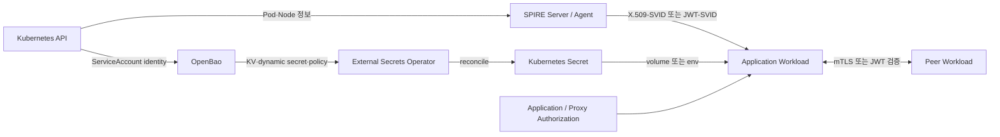

# Workload Identity와 Secret 관리 학습 경로

이 디렉터리는 Kubernetes 환경에서 다음 네 가지 질문에 답하기 위한 한국어 학습 자료입니다.

1. 서비스와 Pod를 **어떻게 신뢰할 수 있는 주체로 식별할 것인가?**
2. 식별된 주체끼리 **어떻게 안전하게 인증하고 통신할 것인가?**
3. 비밀번호·API key·인증서 같은 **비밀값을 어디에 보관하고 어떻게 전달할 것인가?**
4. 위 구성 요소가 고장났을 때 **어디부터 확인하고 어떻게 복구할 것인가?**

이를 위해 다음 기술을 서로 섞지 않고 역할별로 학습합니다.

- **SPIFFE** — workload identity의 표준과 규격
- **SPIRE** — SPIFFE 규격을 실제 환경에 구현하는 identity control plane
- **OpenBao** — secret, 인증 정책, 동적 credential과 lease를 관리하는 secret manager
- **External Secrets Operator(ESO)** — 외부 secret manager의 값을 Kubernetes `Secret`으로 동기화하는 controller

> 핵심: SPIFFE/SPIRE는 주로 **“누구인가”**를 증명하고, OpenBao는 **“무엇을 받을 수 있는가”**를 정책으로 통제하며, ESO는 그 값을 **Kubernetes가 소비할 수 있는 형태로 전달**합니다. 네 제품은 서로 완전히 대체하지 않습니다.

## 문서 기준 시점과 버전

최종 조사일은 **2026-08-17**입니다. 아래 버전은 문서를 작성할 때 확인한 기준일 뿐, 설치 명령에서 무조건 `latest`를 사용하라는 뜻이 아닙니다.

| 구성 요소 | 조사 시점의 기준 | 문서에서의 취급 |
| --- | --- | --- |
| SPIRE | `v1.15.2`, 2026-07-09 공개 | SPIFFE/SPIRE 개념과 예제의 기준 |
| Kubernetes quickstart | Kubernetes `1.29`–`1.34`에서 테스트되었다고 명시 | 그 밖의 버전은 별도 호환성 검증 필요 |
| External Secrets Operator | 애플리케이션 `v2.9.0`, 2026-08-07 공개; chart `2.9.0` | 설치 전 CRD/API와 chart 값을 다시 확인 |
| OpenBao | `v2.6.1`, 2026-07-22 공개 | OpenBao 개념·운영 설명의 기준 |
| ESO 전용 OpenBao provider | 문서상 alpha, ESO `v0.16.1` + OpenBao `v2.2.0` 조합을 명시적으로 시험 | 최신 버전 조합은 사전 호환성 시험 필수 |

버전 관련 중요한 주의점:

- SPIFFE 표준과 SPIRE 구현의 버전은 같은 개념이 아닙니다.
- SPIRE의 일부 문서 페이지는 최신 release보다 한 patch 수준 뒤처질 수 있습니다.
- 현재 Workload API 문서의 WIT-SVID 부분은 **incubating**입니다. 일반 가용 기능처럼 전제하지 않습니다.
- ESO의 전용 OpenBao provider는 현재 문서상 **KV 전용**이며 인증 방식도 AppRole, Kubernetes, token, UserPass로 제한됩니다.
- OpenBao가 Vault API 호환성을 지향하더라도 모든 기능과 모든 버전의 동작이 동일하다는 보장은 아닙니다.
- 운영에서는 “최신 버전”보다 **검증한 정확한 버전 pin + upgrade test**가 더 중요합니다.

설치 직전에는 반드시 공식 release와 chart를 다시 확인합니다.

```bash
# 예: 설치 가능한 chart 버전을 먼저 확인한다.
helm repo update
helm search repo spire --versions | head -20
helm search repo external-secrets --versions | head -20

# 클러스터 버전도 함께 기록한다.
kubectl version
helm version
```

## 전체 구조를 먼저 보기



이 그림에서 혼동하기 쉬운 점은 다음과 같습니다.

- SPIRE가 SVID를 발급했다고 해서 애플리케이션의 업무 권한까지 자동으로 결정되지는 않습니다.
- ESO가 OpenBao에 로그인할 때 현재 TwinX 계열 구성은 Kubernetes ServiceAccount 기반 인증을 사용합니다. 이것이 SPIRE workload identity와 같은 것은 아닙니다.
- Kubernetes `Secret`을 만들지 않고 Workload API나 OpenBao API를 애플리케이션이 직접 사용하는 설계도 가능합니다. 각 방식은 애플리케이션 변경 비용과 secret 노출 면적이 다릅니다.
- SVID는 보통 짧은 수명과 자동 회전을 전제로 합니다. 장기 고정 credential을 대체하려면 애플리케이션이 회전을 따라갈 수 있어야 합니다.

## 추천 학습 순서

| 순서 | 문서 | 무엇을 배우는가 | 완료 기준 |
| --- | --- | --- | --- |
| 1 | [SPIFFE/SPIRE 기초](01-spiffe-spire-fundamentals.md) | 표준, trust domain, SPIFFE ID, SVID, attestation, Workload API | SPIFFE와 SPIRE의 차이를 설명할 수 있음 |
| 2 | [SPIRE Kubernetes 실습](02-spire-kubernetes-lab.md) | 설치, 등록, CSI/Controller Manager, SVID 확인, rotation, 장애 분석 | 특정 Pod가 어떤 SPIFFE ID를 받는지 추적할 수 있음 |
| 3 | [OpenBao 기초](03-openbao-fundamentals.md) | seal, storage, policy, token, lease, auth method, secret engine | OpenBao가 단순 key-value 저장소가 아닌 이유를 설명할 수 있음 |
| 4 | [External Secrets Operator](04-external-secrets-operator.md) | controller/CRD, store scope, lifecycle, template, multi-tenancy | `ExternalSecret` reconcile 흐름을 설명할 수 있음 |
| 5 | [OpenBao + ESO 실습](05-openbao-eso-kubernetes-lab.md) | KV v2, policy, Kubernetes auth, store, sync, rotation, failure injection | secret 하나의 전체 전달 경로를 검증할 수 있음 |
| 6 | [통합 설계와 선택 기준](06-integration-design.md) | identity와 secret의 경계, 위협 모델, GitOps, 다중 클러스터 설계 | 상황별 올바른 패턴을 선택할 수 있음 |
| 7 | [운영·장애 대응·복습](07-operations-and-review.md) | 관측, 진단 순서, alert, tabletop, 문제와 정답 | 장애 원인을 계층별로 분리할 수 있음 |

기존 TwinX 장애의 실제 복구 흐름은 [TwinX OpenBao Sealed 복구 기록](../twinx-openbao-sealed-recovery-2026-06-28.md)을 함께 읽습니다. 학습 문서의 일반 원리가 실제 장애에서 어떻게 나타나는지 보여주는 사례입니다.

## 선수 지식

### 반드시 알고 시작할 것

- Kubernetes `Pod`, `Deployment`, `DaemonSet`, `ServiceAccount`
- `Secret`, volume mount, environment variable
- `Role`, `ClusterRole`, `RoleBinding`, `ClusterRoleBinding`
- TLS 인증서의 public key/private key, CA, certificate chain
- HTTP와 gRPC의 기본 구조
- Helm repository, chart, values, release

### 알면 이해가 빨라지는 것

- PKI, CSR, SAN, JWT의 `iss`·`sub`·`aud`·`exp`
- controller reconciliation loop
- Unix domain socket
- least privilege와 zero trust
- GitOps/Argo CD의 desired state와 live state
- Kubernetes projected ServiceAccount token과 TokenReview

## 10일 학습 계획

하루에 이론 60–90분, 실습 60–120분을 기준으로 한 예시입니다.

### 1일차 — 문제 정의

- IP, DNS 이름, static API key가 workload identity로 부족한 이유를 적습니다.
- 사람 identity와 workload identity의 차이를 정리합니다.
- 인증(authentication), 인가(authorization), secret distribution을 구분합니다.
- [01 문서](01-spiffe-spire-fundamentals.md)의 위협 모델까지 읽습니다.

### 2일차 — SPIFFE 핵심 객체

- `spiffe://example.org/ns/payments/sa/api`를 구성 요소별로 해석합니다.
- trust domain과 DNS domain이 같아야 하는지 설명합니다.
- X.509-SVID와 JWT-SVID를 표로 비교합니다.
- trust bundle이 일반 CA bundle과 어떤 관계인지 정리합니다.

### 3일차 — SPIRE attestation과 등록

- node attestation과 workload attestation을 순서도로 다시 그립니다.
- selector와 registration entry가 어떻게 연결되는지 설명합니다.
- Workload API 호출자가 별도 bearer token 없이 식별되는 이유를 확인합니다.

### 4일차 — SPIRE Kubernetes 실습

- [02 문서](02-spire-kubernetes-lab.md)의 preflight와 설치를 수행합니다.
- Server, Agent, Controller Manager, CSI driver 상태를 확인합니다.
- Pod가 받은 SPIFFE ID와 SVID 만료 시각을 기록합니다.

### 5일차 — SPIRE 회전과 장애

- workload를 재시작하지 않고 SVID가 갱신되는지 관찰합니다.
- selector 불일치, socket 미마운트, Agent 장애를 각각 재현합니다.
- 장애를 “등록 문제 / attestation 문제 / 전달 문제 / 애플리케이션 문제”로 분류합니다.

### 6일차 — OpenBao 핵심

- [03 문서](03-openbao-fundamentals.md)를 읽습니다.
- initialized와 unsealed의 차이를 설명합니다.
- storage encryption barrier와 seal의 역할을 분리합니다.
- token TTL, lease, renewal, revocation을 비교합니다.

### 7일차 — ESO 핵심

- [04 문서](04-external-secrets-operator.md)를 읽습니다.
- `SecretStore`와 `ClusterSecretStore`의 blast radius를 비교합니다.
- `refreshPolicy`, `creationPolicy`, `deletionPolicy` 조합을 표로 정리합니다.
- source secret, `ExternalSecret`, target `Secret`의 소유권을 추적합니다.

### 8일차 — OpenBao + ESO 실습

- [05 문서](05-openbao-eso-kubernetes-lab.md)를 따라 KV 값을 동기화합니다.
- OpenBao policy를 일부러 좁게/잘못 설정한 뒤 ESO 상태와 log를 비교합니다.
- 원본 값 회전 후 target `Secret` 반영 시간을 측정합니다.

### 9일차 — 통합 설계

- [06 문서](06-integration-design.md)의 pattern 중 현재 환경에 맞는 것을 선택합니다.
- trust boundary와 compromise blast radius를 그립니다.
- GitOps에 넣을 것과 절대 넣지 않을 것을 분류합니다.
- 다중 클러스터에서 trust domain과 secret store 경계를 결정합니다.

### 10일차 — 운영 훈련

- [07 문서](07-operations-and-review.md)의 tabletop scenario를 수행합니다.
- sealed OpenBao, invalid store, SPIRE Agent 장애를 구분합니다.
- 복습 문제에 답한 뒤 정답과 비교합니다.
- 실제 환경에 적용하기 전 change plan과 rollback 조건을 작성합니다.

## 실습 환경 권장안

운영 클러스터에 바로 적용하지 않습니다. 다음 중 하나를 사용합니다.

- 로컬 `kind` 또는 `k3d` 클러스터
- 격리된 학습용 Kubernetes namespace/cluster
- 운영과 trust domain, OpenBao storage, credential이 완전히 분리된 sandbox

예시 환경 변수는 문서 전체에서 다음 이름을 사용합니다.

```bash
export LAB_CLUSTER_NAME=identity-lab
export LAB_TRUST_DOMAIN=lab.example.org
export LAB_APP_NAMESPACE=identity-demo
export LAB_SPIRE_NAMESPACE=spire-system
export LAB_OPENBAO_NAMESPACE=openbao
export LAB_ESO_NAMESPACE=external-secrets
```

실제 조직의 domain, token, 주소를 그대로 복사하지 않습니다. 특히 shell 공용 옵션이나 `HOME`, `CODEX_HOME` 같은 시스템 변수를 실습 변수로 재사용하지 않습니다.

## 절대 지켜야 할 안전 규칙

### Git에 넣지 않는 값

- OpenBao root token
- OpenBao unseal key 또는 recovery key
- AppRole `SecretID`
- Kubernetes 장기 ServiceAccount token
- SPIRE Server signing key
- X.509-SVID private key
- 실제 API key, DB password, OAuth client secret
- 운영 kubeconfig와 client certificate private key

### 명령행 인자로 직접 넘기지 않는 값

shell history와 process list에 남을 수 있으므로 아래 형태를 피합니다.

```bash
# 금지 예시
bao login REAL_TOKEN
bao operator unseal REAL_UNSEAL_KEY
kubectl create secret generic app --from-literal=password=REAL_PASSWORD
```

대신 interactive prompt, 승인된 password manager, stdin, 일회성 파일 descriptor 등 해당 도구가 지원하는 안전한 입력 경로를 사용합니다. 실습 문서의 `REPLACE_ME`와 `<PLACEHOLDER>`는 실제 값이 아니라 의도적인 자리표시자입니다.

### 운영 변경 전 중단 기준

다음 중 하나라도 만족하면 실습을 운영 반영으로 확대하지 않습니다.

- rollback 절차와 백업 복구 시험이 없음
- OpenBao seal/recovery material의 보관 책임자가 불명확함
- SPIRE trust domain과 federation 경계가 승인되지 않음
- ESO controller가 접근할 수 있는 secret path 범위가 문서화되지 않음
- `ClusterSecretStore`를 모든 namespace에서 사용할 수 있는데 admission/RBAC 방어가 없음
- audit log와 alert가 없음
- version pin과 upgrade test가 없음

## 무엇을 어디에 저장할 것인가

| 데이터 | 권장 위치/전달 방식 | 이유 | 피해야 할 방식 |
| --- | --- | --- | --- |
| 서비스 identity | SPIRE가 발급한 짧은 수명 SVID | 자동 발급·회전, workload attestation | 이미지에 장기 client certificate 포함 |
| DB password/API key | OpenBao, 필요 시 ESO로 동기화 | 중앙 정책·감사·회전 | Git/Helm values에 평문 저장 |
| Kubernetes controller credential | projected ServiceAccount token | audience와 짧은 TTL | 자동 생성된 장기 SA token Secret |
| 애플리케이션 TLS identity | 가능하면 Workload API 직접 소비 | private key를 파일로 장기 보관하지 않음 | 공용 wildcard certificate 남용 |
| 사용자 로그인 | OIDC/SSO 등 사람 identity 체계 | workload identity와 lifecycle이 다름 | SPIFFE ID를 사람 계정처럼 사용 |
| 공개 CA bundle | ConfigMap 또는 검증된 bundle 배포 경로 | 비밀값은 아니지만 무결성이 중요 | 출처 불명의 bundle 병합 |

## 가장 중요한 용어 빠른 사전

| 용어 | 한 줄 정의 |
| --- | --- |
| Workload | 실행 중인 서비스·프로세스·Pod처럼 identity가 필요한 계산 단위 |
| SPIFFE ID | `spiffe://<trust-domain>/<path>` 형태의 workload 식별 URI |
| Trust domain | SPIFFE identity와 trust bundle의 관리 경계 |
| SVID | SPIFFE ID를 증명하는 검증 가능한 문서; 주로 X.509 또는 JWT |
| Trust bundle | 특정 trust domain의 SVID를 검증하는 신뢰 material |
| Workload API | workload가 자신의 SVID와 bundle을 가져오는 로컬 streaming API |
| Attestation | node 또는 workload의 속성을 검증해 identity 발급 자격을 판단하는 과정 |
| Selector | UID, namespace, ServiceAccount 같은 attested 속성 |
| Registration entry | selector가 일치하는 workload에 어떤 SPIFFE ID를 줄지 정한 규칙 |
| Seal | OpenBao의 암호화 barrier를 열 수 없도록 잠긴 상태 |
| Secret engine | OpenBao가 KV·PKI·DB credential 등을 제공하는 플러그인 경로 |
| Auth method | 클라이언트가 OpenBao token을 얻기 위해 자신을 증명하는 방식 |
| Policy | OpenBao API path에 허용할 capability를 기술한 규칙 |
| Lease | 동적 secret/token의 유효 기간과 갱신·폐기 단위 |
| ESO | 외부 provider와 Kubernetes `Secret` 사이를 reconcile하는 controller |
| `SecretStore` | 한 namespace 안에서 사용하는 provider 연결 설정 |
| `ClusterSecretStore` | 여러 namespace에서 참조할 수 있는 cluster-scoped provider 설정 |
| `ExternalSecret` | 외부 값을 읽어 target Kubernetes `Secret`을 만들도록 선언하는 CR |
| Reconcile | desired state와 실제 상태를 반복 비교해 맞추는 controller 동작 |

## 학습 완료 체크리스트

다음 질문에 자료를 보지 않고 답할 수 있으면 기본 과정을 완료한 것입니다.

- [ ] SPIFFE와 SPIRE의 차이를 한 문장으로 설명할 수 있다.
- [ ] SPIFFE ID, SVID, trust bundle의 관계를 설명할 수 있다.
- [ ] node attestation과 workload attestation의 순서를 설명할 수 있다.
- [ ] X.509-SVID와 JWT-SVID 중 언제 무엇을 선택할지 말할 수 있다.
- [ ] SPIFFE가 authentication을 제공해도 authorization이 별도로 필요한 이유를 안다.
- [ ] OpenBao의 initialized, sealed, unsealed를 구분할 수 있다.
- [ ] token, lease, policy, auth method, secret engine의 관계를 설명할 수 있다.
- [ ] `SecretStore`와 `ClusterSecretStore`의 보안 경계를 비교할 수 있다.
- [ ] `ExternalSecret`의 원본 값이 target `Secret`으로 오는 단계를 추적할 수 있다.
- [ ] OpenBao가 sealed 되었을 때 ESO와 애플리케이션에 어떤 증상이 생기는지 설명할 수 있다.
- [ ] secret 값이나 private key를 노출하지 않고 상태를 진단할 수 있다.
- [ ] identity 장애와 secret distribution 장애를 서로 구분할 수 있다.

## 공식 자료 우선순위

이 자료는 다음 순서로 근거를 사용합니다.

1. SPIFFE specification과 SPIFFE/SPIRE 공식 문서
2. SPIRE, SPIFFE CSI, SPIRE Controller Manager 공식 release/repository
3. External Secrets Operator 공식 API/guide/release
4. OpenBao 공식 documentation/API/release notes
5. Kubernetes 공식 ServiceAccount, TokenReview, RBAC 문서

주요 시작점:

- [SPIFFE specifications](https://spiffe.io/docs/latest/spiffe-specs/)
- [SPIRE concepts](https://spiffe.io/docs/latest/spire-about/spire-concepts/)
- [SPIRE hardened Helm charts](https://spiffe.io/docs/latest/spire-helm-charts-hardened-about/)
- [External Secrets Operator documentation](https://external-secrets.io/)
- [ESO OpenBao provider](https://external-secrets.io/main/provider/openbao/)
- [OpenBao documentation](https://openbao.org/docs/)
- [Kubernetes Service Accounts](https://kubernetes.io/docs/concepts/security/service-accounts/)
- [Kubernetes TokenReview API](https://kubernetes.io/docs/reference/kubernetes-api/authentication-resources/token-review-v1/)

## 문서 유지보수 규칙

새 버전으로 갱신할 때는 문장만 고치지 말고 다음을 함께 확인합니다.

1. release date와 supported/tested Kubernetes 범위
2. Helm chart version과 image version의 관계
3. CRD `apiVersion`, required field, default 변화
4. auth method와 token audience/issuer 동작 변화
5. provider stability 등급과 명시적 테스트 조합
6. security advisory와 breaking change
7. 예제 명령의 dry-run 또는 격리 환경 재실행 결과
8. 기존 TwinX runbook과 충돌하는 설명 유무

검증되지 않은 최신 기능은 **“공식 지원”**이라고 쓰지 않습니다. API 호환성에 기대는 구성은 반드시 **“호환성 기반 추론이며 사전 검증 필요”**라고 표시합니다.
